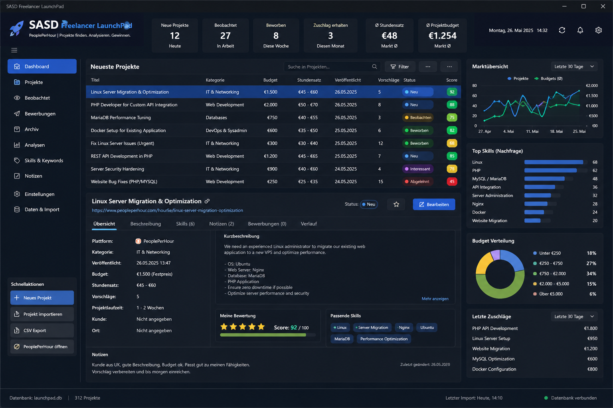

# SASD Freelancer LaunchPad

**SASD Freelancer LaunchPad** is a local-first Windows desktop application for discovering, capturing, evaluating and tracking freelance opportunities across multiple platforms.

The application starts as a practical daily workspace for technical freelancers and is designed to grow into a personal, cross-platform **Freelancer Opportunity & Market Intelligence System** as real historical data accumulates.

> **Find opportunities. Keep the history. Learn what works.**

## Product direction

LaunchPad is designed around the following workflow:

```text
Discover
   ↓
Capture
   ↓
Evaluate
   ↓
Apply
   ↓
Observe
   ↓
Interact
   ↓
Outcome
   ↓
Learn
   ↓
Improve
   ↺
```

The first product focus is intentionally narrow:

- software developers
- Linux / Unix / DevOps specialists
- administrators
- technical consultants
- related technical freelancers

The domain model remains open enough to support additional project-oriented freelance professions later.

## Core concepts

LaunchPad deliberately separates concepts that are often mixed together in simple project trackers:

```text
Opportunity ≠ Listing
Opportunity ≠ Proposal
Opportunity Status ≠ Archive
Published Rate ≠ Own Proposal Rate
Hourly ≠ Daily ≠ Fixed
Unknown ≠ 0
Note ≠ Activity
```

An **Opportunity** represents the real potential project.

A **Listing** represents a concrete place where that Opportunity was published, for example on Freelancermap, PeoplePerHour or GULP / Randstad Professional.

The same real Opportunity may therefore later have multiple Listings through different platforms or intermediaries.

## Initial sources

Initially important sources include:

- Freelancermap
- PeoplePerHour
- GULP / Randstad Professional

Additional platforms and capture mechanisms can be added later through defined integration boundaries.

Platforms are **sources**, not the product itself.

## Local-first

The personal LaunchPad knowledge base is stored locally.

Local features should remain usable without an Internet connection. External platform integration, discovery, browser capture and optional AI support may extend the application later without becoming prerequisites for the core workflow.

## Planned MVP scope

The first practically useful product state focuses on:

- manually capturing Opportunities
- retaining source / Listing information
- storing the full original listing description
- skills and notes
- published fixed budgets, hourly rates and daily rates
- location / remote information
- flexible local search and filtering
- Opportunity status
- archive / restore
- Proposal Lite
- local backup
- reliable local persistence

Automated multi-platform discovery is intentionally introduced only after the local Opportunity / Listing model and duplicate handling are reliable.

## Screenshot

Preliminary dashboard / product direction:



The screenshot illustrates the intended information density and product direction. Individual controls, labels and metrics may change as the implementation follows the current requirements and architecture baseline.

## Architecture

The current architecture baseline defines LaunchPad as a:

- local-first
- modular monolith
- domain-centred application
- Windows desktop product
- system with explicit ports/adapters at external and technical boundaries

The dependency direction is:

```text
Presentation
    ↓
Application
    ↓
Domain

Infrastructure / Integrations
    → implement external and technical boundaries
```

The early concrete implementation uses:

- C#
- .NET 10
- Windows Forms
- SQLite
- Microsoft.Data.Sqlite
- xUnit

## Documentation

The repository documentation is intentionally numbered so the product chain remains visible in one directory:

| Document | Purpose |
|---|---|
| `docs/010_Lastenheft.md` | Product requirements: what and why |
| `docs/020_Pflichtenheft_MVP.md` | Concrete MVP behaviour and acceptance |
| `docs/030_Technical_Design.md` | Concrete technical implementation design |
| `docs/040_Database_Design.md` | SQLite persistence model and migration design |
| `docs/045_Competitive_Product_Feature_Inventory.md` | Research and competitive feature evidence |
| `docs/050_Architecture.md` | Long-term architecture boundaries and dependency rules |
| `docs/060_Product_Roadmap.md` | Development phases and sequencing |

Research documents are evidence, not automatically requirements.

## Development principles

The project follows three central product principles:

> **Practical utility before perfection.**

> **Capture first. History instead of overwrite.**

> **Learn from real opportunities and real outcomes.**

A further architecture rule applies throughout the project:

> **Stay open for the future without implementing the future in advance.**

## Status

The project is currently transitioning from the first prototype to the consolidated Opportunity / Listing architecture baseline.

The documentation baseline is ahead of the current prototype code. The next implementation work should therefore migrate the existing `Project`-centred prototype to the new:

```text
Opportunity
  ├── Listing(s)
  ├── Skills
  ├── Notes
  └── Proposal(s)
```

model before adding larger automation features.

## License

See [LICENSE](LICENSE).
