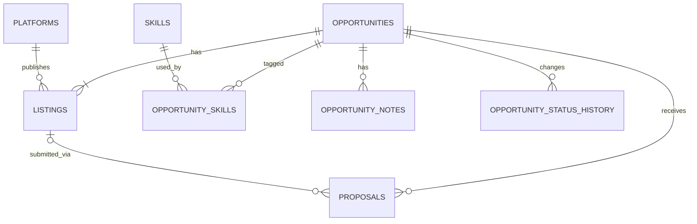

# SASD Freelancer LaunchPad – Database Design

**Version:** 0.2  
**Status:** Baseline-Kandidat – auf Opportunity/Listing-Architektur umgestellt  
**Projekt:** SASD Freelancer LaunchPad  
**Organisation:** SASD GmbH  
**Dokumenttyp:** Database Design  
**Sprache:** Deutsch  
**Stand:** 24.08.2026  
**Führende Grundlagen:** `010_Lastenheft.md`, `020_Pflichtenheft_MVP.md`, `030_Technical_Design.md`, `050_Architecture.md`

---

# 0. Dokumentkontrolle

## 0.1 Zweck

Dieses Dokument definiert das persistente SQLite-Zielmodell.

Es beantwortet:

> **Wie werden die fachlichen Daten so gespeichert, dass Opportunity, Fundstellen, Proposal, Skills, Notes und spätere Historie konsistent bleiben?**

---

## 0.2 Wichtigste Änderung gegenüber Version 0.1

Das alte Schema:

```text
platforms
projects
project_skills
project_notes
project_status_history
```

kombinierte:

- reales Projekt,
- Plattformfundstelle,
- ausgeschriebene Konditionen,
- Bewerbungsstatus

zu stark in `projects`.

Diese Semantik ist nicht mehr zulässig.

Das Zielmodell lautet:

```text
Opportunity
  ├── 1..n Listing
  ├── n Skills
  ├── n Notes
  ├── Status History
  └── 0..n Proposal
```

---

# 1. Persistenzprinzipien

## 1.1 Local-first

**DB-001**

Die kanonische Benutzer-Datenbank ist eine lokale SQLite-Datei.

---

## 1.2 Datenbankpfad

Standard:

```text
%LOCALAPPDATA%\SASD\FreelancerLaunchPad\freelancer_launchpad.db
```

---

## 1.3 SQLite-Typen bewusst verwenden

SQLite besitzt dynamische Typisierung.

Das Schema nutzt deshalb:

- `INTEGER` für IDs, Booleans und skalierte Geldwerte,
- `TEXT` für Strings, Enums, UTC-Zeitpunkte und Date-only-Werte.

---

## 1.4 Foreign Keys

**DB-002**

Jede produktive Connection aktiviert:

```sql
PRAGMA foreign_keys = ON;
```

---

## 1.5 WAL

Für die lokale Desktop-Nutzung vorgesehen:

```sql
PRAGMA journal_mode = WAL;
PRAGMA synchronous = NORMAL;
PRAGMA busy_timeout = 5000;
```

Backup verwendet trotzdem die SQLite Backup API und keine blinde Kopie.

---

# 2. IDs

## 2.1 Interne IDs

**DB-003**

Interne Primärschlüssel bleiben:

```text
INTEGER PRIMARY KEY
```

und werden im C#-Code als `long` verwendet.

---

## 2.2 Begründung

- bestehender Prototyp nutzt `long`,
- sehr gute SQLite-Unterstützung,
- kompakte Indizes,
- Migration alter Project-IDs möglich,
- keine Multi-Device-Merge-Anforderung im MVP.

---

## 2.3 Externe IDs

Externe Portal-IDs sind **keine Primärschlüssel**.

Sie gehören zum Listing:

```text
platform_id + external_id
```

---

# 3. Zeitrepräsentation

## 3.1 UTC-Instant

**DB-004**

Zeitpunkte werden als kanonisches ISO-8601-UTC-TEXT gespeichert.

Format:

```text
yyyy-MM-ddTHH:mm:ss.fffffffZ
```

Beispiel:

```text
2026-08-24T06:15:42.1234567Z
```

---

## 3.2 Sortierbarkeit

Bei identischem kanonischem Format ist lexikographische Sortierung gleich zeitlicher Sortierung.

---

## 3.3 Date-only

Kalendertage ohne konkrete Uhrzeit werden als:

```text
YYYY-MM-DD
```

gespeichert.

Beispiel:

```text
expected_start_date = 2026-09-15
```

---

## 3.4 Keine erfundene Zeitzone

Unsichere externe Zeitangaben dürfen später nicht als sicherer UTC-Zeitpunkt gespeichert werden, ohne dass der Adapter die Umrechnung begründen kann.

---

# 4. Geldrepräsentation

## 4.1 Kein REAL für kanonische Geldwerte

**DB-005**

Kanonische Preis-/Ratewerte werden nicht als binäres `REAL` gespeichert.

---

## 4.2 Fixed Scale

LaunchPad speichert Geldwerte als skalierte Integerwerte mit:

```text
SCALE = 10,000
```

Beispiel:

```text
85.50 EUR
→ 855000
```

---

## 4.3 Warum vier Nachkommastellen

Vier Nachkommastellen sind für:

- Hourly Rates,
- Daily Rates,
- Fixed Budgets

mehr als ausreichend und vermeiden binäre Rundungsartefakte.

---

## 4.4 Domain-Konvertierung

C# arbeitet weiterhin mit `decimal`.

Persistenzadapter:

```text
decimal ↔ scaled INTEGER
```

---

## 4.5 Keine Einheitenumrechnung

**DB-006**

Skalierte Speicherung bedeutet keine Umrechnung zwischen:

- Fixed,
- Hourly,
- Daily.

Diese Werte erhalten getrennte Spalten.

---

# 5. Tabellenübersicht

| Tabelle | MVP | Zweck |
|---|---:|---|
| `schema_migrations` | ja | Schema-Versionierung |
| `platforms` | ja | Freelancer-Portale |
| `opportunities` | ja | reales potentielles Projekt |
| `listings` | ja | konkrete Plattformfundstelle |
| `skills` | ja | Skills/Keywords |
| `opportunity_skills` | ja | n:m Opportunity ↔ Skill |
| `opportunity_notes` | ja | User Notes |
| `opportunity_status_history` | ja | relevante Statushistorie |
| `proposals` | ja | Proposal Lite |
| `search_profiles` | später | Discovery |
| `discovery_runs` | später | Discovery-Zuverlässigkeit |
| `observations` | später | Markthistorie |
| `companies` | später | Organisationen |
| `contacts` | später | berufliche Personen |
| `activities` | später | Ereignisse/Follow-ups |

---

# 6. Entity Relationship



---

# 7. `schema_migrations`

## 7.1 Zweck

Jede angewendete Migration wird einmal protokolliert.

Spalten:

| Spalte | Typ | Regel |
|---|---|---|
| `version` | INTEGER | PK |
| `name` | TEXT | UNIQUE |
| `checksum_sha256` | TEXT | Pflicht |
| `applied_at_utc` | TEXT | Pflicht |

---

## 7.2 Keine Mutation angewendeter Migrationen

**DB-007**

Ändert sich der Checksum einer bereits angewendeten Migration, muss Startup mit Diagnosefehler abbrechen.

Eine alte Migration wird nicht still neu interpretiert.

---

# 8. `platforms`

## 8.1 Semantik

`platforms` speichert Portale, nicht Capture-Methoden.

Beispiele:

```text
Freelancermap
PeoplePerHour
Randstad Professional / GULP
```

---

## 8.2 Kein `Manual`

**DB-008**

`Manual` darf nicht als Platform-Seed angelegt werden.

`Manual` ist eine `capture_method`.

---

## 8.3 Spalten

| Spalte | Typ | Null | Bedeutung |
|---|---|---:|---|
| `id` | INTEGER | nein | PK |
| `platform_key` | TEXT | nein | stabiler technischer Schlüssel |
| `display_name` | TEXT | nein | UI-Name |
| `base_url` | TEXT | ja | Portalbasis |
| `is_active` | INTEGER | nein | aktiv/deaktiviert |
| `created_at_utc` | TEXT | nein | Anlage |
| `updated_at_utc` | TEXT | nein | Änderung |

---

# 9. `opportunities`

## 9.1 Semantik

Eine Zeile ist:

> **das reale potentielle Projekt, nicht die Webseite.**

---

## 9.2 Spalten

| Spalte | Typ | Null | Bedeutung |
|---|---|---:|---|
| `id` | INTEGER | nein | lokale Opportunity-ID |
| `canonical_title` | TEXT | nein | eigener/kanonischer Titel |
| `status` | TEXT | nein | Opportunity-Workflow |
| `dismiss_reason` | TEXT | ja | optionaler Ablehnungsgrund |
| `end_client_name` | TEXT | ja | bekannter Endkunde als frühes Textfeld |
| `is_archived` | INTEGER | nein | Arbeitsarchiv |
| `archived_at_utc` | TEXT | ja | Archivzeitpunkt |
| `created_at_utc` | TEXT | nein | erstellt |
| `updated_at_utc` | TEXT | nein | geändert |

---

## 9.3 Statuswerte

```text
new
reviewing
interesting
watching
dismissed
closed
cancelled
expired
```

---

## 9.4 Archiv-Invariante

**DB-009**

```text
is_archived = 0 → archived_at_utc IS NULL
is_archived = 1 → archived_at_utc IS NOT NULL
```

---

## 9.5 Kein Platform FK

**DB-010**

`opportunities` besitzt bewusst **kein `platform_id`**.

Die Platform gehört zum Listing.

---

# 10. `listings`

## 10.1 Semantik

Ein Listing ist die konkrete Veröffentlichung/Fundstelle.

Beispiel:

```text
Opportunity:
Linux Migration Endkunde X

Listing 1:
Freelancermap / Vermittler A / URL A / 85 EUR/h

Listing 2:
GULP / Vermittler B / URL B / 95 EUR/h
```

---

## 10.2 Identifikation

Listing besitzt:

- interne ID,
- Platform,
- optionale External ID,
- optionale URL,
- normalisierte URL.

---

## 10.3 Source-Felder

Listing enthält:

- `source_title`,
- `original_description`,
- source-spezifische Konditionen,
- PublishedAt,
- Ort,
- Remote,
- Vermittler.

---

## 10.4 Zeitfelder

| Feld | Bedeutung |
|---|---|
| `published_at_utc` | veröffentlichter Zeitpunkt, falls sicher bekannt |
| `first_observed_at_utc` | erstmals durch Nutzer/System gesehen |
| `captured_at_utc` | in LaunchPad übernommen |
| `last_observed_at_utc` | zuletzt geprüft |

---

## 10.5 LastObservedAt

**DB-011**

`last_observed_at_utc` darf nach Closed/Expired weiter aktualisiert werden.

---

## 10.6 Remote

`remote_percent`:

```text
NULL = unbekannt
0 = vollständig onsite
100 = vollständig remote
```

---

## 10.7 Work Mode

Optional:

```text
remote
hybrid
onsite
unknown
```

`NULL` bedeutet ebenfalls „nicht erfasst“.

`unknown` kann später bewusst verwendet werden, wenn die Quelle explizit keine klare Einordnung zulässt.

---

# 11. Listing-Konditionen

## 11.1 Ein Währungscode

Für den frühen Listing-Datensatz wird ein gemeinsamer:

```text
currency_code
```

für veröffentlichte Konditionen verwendet.

---

## 11.2 Fixed Budget

```text
fixed_budget_min_scaled
fixed_budget_max_scaled
```

---

## 11.3 Hourly

```text
hourly_rate_min_scaled
hourly_rate_max_scaled
```

---

## 11.4 Daily

```text
daily_rate_min_scaled
daily_rate_max_scaled
```

---

## 11.5 Range-Semantik

Erlaubt:

```text
min gesetzt, max NULL   → ab
min NULL, max gesetzt   → bis
min = max               → exakter Wert
min < max               → Range
beide NULL              → unbekannt/nicht angegeben
```

---

## 11.6 Currency-Invariante

**DB-012**

Sobald irgendein Money-Feld gesetzt ist, muss `currency_code` gesetzt sein.

---

# 12. Listing-Duplikate

## 12.1 External ID

Partial Unique Index:

```text
(platform_id, external_id)
```

wenn External ID vorhanden.

---

## 12.2 URL

Partial Unique Index:

```text
(platform_id, normalized_url)
```

wenn URL vorhanden.

---

## 12.3 Warum Platform Teil des Keys ist

Dieselbe numerische ID kann auf verschiedenen Portalen existieren.

---

## 12.4 Keine semantische Merge-Constraint

**DB-013**

Die Datenbank entscheidet nicht, ob zwei unterschiedliche Listings dasselbe reale Projekt darstellen.

Das ist Application-/Benutzerlogik.

---

# 13. `skills`

## 13.1 Spalten

```text
id
name
normalized_name
is_active
created_at_utc
updated_at_utc
```

---

## 13.2 Normalized Name

Unique.

Beispiele:

```text
" Linux " → "linux"
"LINUX"   → "linux"
```

---

## 13.3 Kein Alias-System im MVP

`K8s` und `Kubernetes` dürfen noch getrennte Skills sein.

---

# 14. `opportunity_skills`

n:m-Verknüpfung.

PK:

```text
(opportunity_id, skill_id)
```

Beim Löschen einer Opportunity:

```text
ON DELETE CASCADE
```

Beim Löschen eines Links bleibt der Skill erhalten.

---

# 15. `opportunity_notes`

## 15.1 Warum eigene Tabelle

**DB-014**

Notes bleiben als eigene Tabelle erhalten.

Gründe:

- vorhandenes Legacy-Schema besitzt bereits mehrere Notes,
- spätere mehrere Notes sind vorgesehen,
- kein Informationsverlust bei Migration,
- Note bleibt sauber von Activity getrennt.

---

## 15.2 Spalten

```text
id
opportunity_id
note_text
created_at_utc
updated_at_utc
```

---

# 16. `opportunity_status_history`

## 16.1 Zweck

Gezielte fachliche Historie.

---

## 16.2 Spalten

```text
id
opportunity_id
old_status
new_status
changed_at_utc
comment
```

---

## 16.3 Kein Event Sourcing

**DB-015**

Die Opportunity wird nicht aus dieser Tabelle rekonstruiert.

`opportunities.status` ist der aktuelle Zustand.

---

## 16.4 Keine identische Transition

DB-Constraint verhindert:

```text
old_status = new_status
```

---

# 17. `proposals`

## 17.1 Semantik

Eine Zeile dokumentiert ein eigenes Angebot/eine Bewerbung.

---

## 17.2 Keine 1:1-Constraint

**DB-016**

Das Schema erzwingt nicht „höchstens ein Proposal je Opportunity“.

Die MVP-UI darf diesen Workflow vereinfachen.

---

## 17.3 Listing-Verweis

`listing_id` ist optional.

Wenn vorhanden, muss das Listing zur gleichen Opportunity gehören.

---

## 17.4 Composite FK

Zur Absicherung:

```text
FOREIGN KEY (listing_id, opportunity_id)
REFERENCES listings(id, opportunity_id)
```

Damit ist ein Cross-Opportunity-Listing technisch unmöglich.

---

## 17.5 Proposal State

```text
submitted
awaiting_response
closed
```

---

## 17.6 Outcome

```text
won
rejected
withdrawn
timed_out_by_user
unknown
```

---

## 17.7 State-/Outcome-Regel

**DB-017**

```text
state = closed      → outcome muss gesetzt sein
state != closed     → outcome muss NULL sein
```

---

## 17.8 Eigene Konditionen

Getrennt:

```text
proposed_fixed_amount_scaled
proposed_hourly_amount_scaled
proposed_daily_amount_scaled
```

Keine automatische Konvertierung.

---

## 17.9 CV-/Profilversion

Einfaches Textfeld:

```text
CV Linux DevOps 2026-08
```

Kein Attachment-FK im MVP.

---

# 18. Constraints vs. Application Validation

## 18.1 Datenbank erzwingt

- FK-Integrität,
- Statuswerte,
- Archive-Konsistenz,
- Money >= 0,
- Range Min <= Max,
- Remote 0..100,
- Proposal State/Outcome,
- Duplicate External ID/URL,
- eindeutige Skills.

---

## 18.2 Application erzwingt

- URI-Plausibilität,
- verständliche Validation Messages,
- Plattformwahl,
- semantische Duplicate-Entscheidung,
- User-Workflow,
- Listing/Opportunity-Merge.

---

## 18.3 Nicht jede Regel als CHECK

**DB-018**

Externe Daten dürfen nicht durch überaggressive CHECK-Constraints unimportierbar werden.

Constraints schützen echte Invarianten, nicht Vermutungen.

---

# 19. Indizes

## 19.1 Opportunity

```text
status
is_archived
updated_at_utc
```

---

## 19.2 Listing

```text
opportunity_id
platform_id
published_at_utc
last_observed_at_utc
```

---

## 19.3 Skills

`normalized_name` ist bereits UNIQUE/indexiert.

---

## 19.4 Proposal

```text
opportunity_id
listing_id
submitted_at_utc
```

---

# 20. MVP-Freitextsuche

## 20.1 Kein FTS5 zunächst

MVP darf mit `LIKE` arbeiten.

---

## 20.2 Suchquellen

- `opportunities.canonical_title`
- `listings.source_title`
- `listings.original_description`
- `opportunity_notes.note_text`
- `skills.name`

---

## 20.3 Projektion

Listenabfrage soll große `original_description`-Texte nicht unnötig zurückliefern.

---

# 21. Beispiel: aktive Opportunities

```sql
SELECT
    o.id,
    o.canonical_title,
    o.status,
    o.is_archived,
    l.platform_id,
    l.published_at_utc,
    l.updated_at_utc
FROM opportunities o
JOIN listings l
  ON l.opportunity_id = o.id
WHERE o.is_archived = 0
ORDER BY COALESCE(l.published_at_utc, o.updated_at_utc) DESC;
```

Für mehrere Listings muss die produktive Grid-Abfrage eine definierte Primary-/Display-Listing-Strategie verwenden.

Diese Strategie gehört in Application/Technical Design, nicht als Datenbank-Wahrheit.

---

# 22. Beispiel: Skillfilter

```sql
SELECT DISTINCT
    o.id,
    o.canonical_title,
    o.status
FROM opportunities o
JOIN opportunity_skills os
  ON os.opportunity_id = o.id
JOIN skills s
  ON s.id = os.skill_id
WHERE s.normalized_name = @skill
  AND o.is_archived = 0;
```

---

# 23. Beispiel: Zeitraumfilter

```sql
SELECT DISTINCT
    o.id,
    o.canonical_title
FROM opportunities o
JOIN listings l
  ON l.opportunity_id = o.id
WHERE l.published_at_utc >= @fromUtc
  AND l.published_at_utc < @toUtc
  AND o.is_archived = 0;
```

---

# 24. Beispiel: Freitext

Konzeptionell:

```sql
WHERE
    o.canonical_title LIKE @pattern
    OR EXISTS (
        SELECT 1
        FROM listings l
        WHERE l.opportunity_id = o.id
          AND (
              l.source_title LIKE @pattern
              OR l.original_description LIKE @pattern
          )
    )
    OR EXISTS (
        SELECT 1
        FROM opportunity_notes n
        WHERE n.opportunity_id = o.id
          AND n.note_text LIKE @pattern
    )
```

Alle Parameter werden gebunden.

---

# 25. Delete-Verhalten

## 25.1 Opportunity Delete

Cascade:

- Listings,
- Opportunity Skills,
- Notes,
- Status History,
- Proposals.

---

## 25.2 Platform

**DB-019**

Eine Platform mit referenzierten Listings wird nicht hart gelöscht.

Sie wird deaktiviert.

---

## 25.3 Skill

Ein Skill darf gelöscht werden, wenn gewünscht; Zuordnungen cascaden.

Normalfall ist Deaktivierung/Wiederverwendung.

---

# 26. Archivierung

Archivierung ist kein Delete.

Nur:

```text
opportunities.is_archived
opportunities.archived_at_utc
```

ändern.

Listings/Proposals/Notes bleiben unverändert.

---

# 27. Seed-Daten

Produktive Plattform-Seeds:

```text
platform_key: freelancermap
display_name: Freelancermap

platform_key: peopleperhour
display_name: PeoplePerHour

platform_key: randstad-professional-gulp
display_name: Randstad Professional / GULP
```

---

# 28. Schema-Migration

## 28.1 Zwei Startfälle

### Fresh Install

Neue Zielstruktur direkt erzeugen.

### Legacy Prototype

Vorhandene `projects`-Struktur kontrolliert migrieren.

---

## 28.2 Kein Löschen des Altstands

**DB-020**

Vor Legacy-Migration:

1. konsistentes Backup,
2. Migration,
3. Validierung,
4. erst danach alte Tabellen entfernen/umbenennen.

---

## 28.3 Rebaseline der SQL-Dateien

Da der bisherige `001/002`-Stand ein noch nicht veröffentlichter Prototyp ist, darf das Repository für die neue Baseline bereinigt werden.

Wichtig:

> Bereits existierende lokale Datenbanken werden dadurch nicht einfach ignoriert.

Für sie existiert ein eigener Legacy-Migrationspfad.

---

# 29. Legacy-Mapping `projects` → `opportunities` + `listings`

## 29.1 Opportunity

```text
projects.id
→ opportunities.id

projects.title
→ opportunities.canonical_title

projects.created_at
→ opportunities.created_at_utc

projects.updated_at
→ opportunities.updated_at_utc

projects.is_archived
→ opportunities.is_archived
```

---

## 29.2 Listing

```text
projects.platform_id
→ listings.platform_id

projects.title
→ listings.source_title

projects.url
→ listings.source_url

projects.description/source_text
→ listings.original_description

projects.external_reference
→ listings.external_id

projects.published_at
→ listings.published_at_utc

projects.created_at
→ listings.first_observed_at_utc
→ listings.captured_at_utc
→ initial listings.last_observed_at_utc
```

---

## 29.3 Altpreise

```text
budget_amount
→ fixed budget exact

hourly_rate
→ hourly rate exact

currency
→ currency_code
```

Alte `REAL`-Werte werden über C# `decimal` gelesen und kontrolliert in scaled Integer transformiert.

---

# 30. Legacy-Statusmigration

## 30.1 Mapping

| Alt | Neu |
|---|---|
| `new` | `new` |
| `interesting` | `interesting` |
| `watching` | `watching` |
| `applied` | Opportunity `interesting` + Proposal |
| `rejected` ohne vorheriges applied | Opportunity `dismissed` |
| `rejected` nach applied | Opportunity `closed` + Proposal outcome `rejected` |
| `won` | Opportunity `closed` + Proposal outcome `won` |
| `archived` | `is_archived=1`, fachlichen Vorstatus aus History ableiten |

---

## 30.2 `Applied`

Proposal `submitted_at_utc`:

1. wenn Status History Übergang nach `applied` enthält: dessen Zeit,
2. sonst `projects.updated_at`.

---

## 30.3 Ambiguität

**DB-021**

Ambiguitäten werden in einem Migrationsreport dokumentiert.

Keine stille Erfindung externer Fakten.

---

# 31. Legacy Notes

Alle:

```text
project_notes
```

werden in:

```text
opportunity_notes
```

migriert.

IDs dürfen neu vergeben werden.

Text und Zeitstempel bleiben erhalten.

---

# 32. Legacy Status History

`project_status_history` wird soweit fachlich sinnvoll nach `opportunity_status_history` migriert.

Statuswerte `applied`, `won`, `rejected`, `archived` werden nicht blind als neue Opportunity-Statuswerte übernommen.

---

# 33. Legacy Platforms

## 33.1 Bekannte Plattformen

Namen werden auf stabile Keys normalisiert.

---

## 33.2 Legacy `Manual`

Falls `Manual` existiert:

- prüfen, welche Projects damit verknüpft sind,
- wenn die echte Plattform aus URL/Notiz bekannt ist, zuordnen,
- sonst Migrationswarnung.

`Manual` bleibt nicht als normale Platform der neuen Baseline erhalten.

---

# 34. Backup-Konsistenz

## 34.1 WAL und Raw Copy

Bei WAL darf nicht davon ausgegangen werden, dass nur die `.db`-Datei den vollständigen aktuellen Stand enthält.

---

## 34.2 Backup API

**DB-022**

Produktives Backup verwendet einen konsistenten SQLite-Snapshot.

---

# 35. Restore-Vorbereitung

Restore ist nicht MVP-MUSS.

Das Backup enthält trotzdem:

- vollständige DB,
- Schema-Version,
- Produktversion,
- Erstellungszeit UTC.

Damit wird Restore später möglich, ohne das Backupformat neu zu erfinden.

---

# 36. Spätere `search_profiles`

Noch nicht im MVP.

Konzeptionell später:

```text
search_profiles
search_profile_platform_state
```

Wichtig:

```text
LastSuccessfulCheck
```

gehört pro:

```text
SearchProfile × Platform
```

und nicht nur global zum Search Profile.

---

# 37. Spätere Discovery Runs

Mögliche Tabelle:

```text
discovery_runs
```

mit:

- SearchProfile,
- Platform,
- StartedAt,
- FinishedAt,
- ResultStatus,
- NewCount,
- ExistingCount,
- ErrorSummary.

Nur ein erfolgreicher vollständiger Lauf aktualisiert `LastSuccessfulCheck`.

---

# 38. Spätere Observations

Observation gehört grundsätzlich zum Listing.

Begründung:

- Proposal Count ist quellenspezifisch,
- published rate kann quellenspezifisch sein,
- Award-Sichtbarkeit kann quellenspezifisch sein.

---

# 39. Spätere Company/Contact-Migration

MVP speichert:

```text
opportunities.end_client_name
listings.intermediary_name
```

als frühe Textfelder.

Später:

```text
companies
contacts
opportunity_company_roles
listing_company_roles
```

Die alten Textwerte dienen als Migrationsquelle/Originalbezeichnung.

---

# 40. Keine Zukunftstabellen auf Vorrat

**DB-023**

Die Tabellen aus Kapiteln 36–39 werden nicht allein wegen ihrer Dokumentation im MVP angelegt.

---

# 41. Integritätsprüfungen

Nach Migration/Startup können geprüft werden:

```sql
PRAGMA foreign_key_check;
PRAGMA integrity_check;
```

---

## 41.1 Migration Acceptance

**DB-024**

Nach einer Legacy-Migration muss mindestens gelten:

- Anzahl Opportunities = Anzahl Legacy Projects,
- jedes Opportunity besitzt mindestens ein Listing,
- keine verwaiste FK-Beziehung,
- alle Notes erhalten,
- alle Skill Links erhalten,
- alle alten Applied/Won-Fälle wurden als Proposal behandelt oder als Review-Warnung markiert.

---

# 42. Datenbanktests

Mindestens:

1. Fresh Schema creation
2. Seed Plattformen
3. Create Opportunity + Listing atomar
4. zweite Listing-Fundstelle
5. duplicate External ID blockiert
6. duplicate normalized URL blockiert
7. gleiche External ID auf anderer Platform erlaubt
8. Archive-Invariante
9. Remote Percent Grenzen
10. Money min/max
11. Money ohne Currency abgewiesen
12. Proposal Listing gehört falscher Opportunity → FK-Fehler
13. Proposal Closed ohne Outcome → Fehler
14. Proposal offen mit Outcome → Fehler
15. Cascade Delete
16. Status History
17. Legacy Project Migration
18. Legacy Applied → Proposal
19. Backup Snapshot
20. `PRAGMA foreign_key_check` sauber

---

# 43. Ziel-DDL

Das folgende SQL beschreibt den **normativen Zielzustand** des MVP-Schemas.

Die endgültigen Migrationsdateien dürfen den Zielzustand schrittweise erzeugen.

```sql
PRAGMA foreign_keys = ON;

CREATE TABLE schema_migrations (
    version INTEGER PRIMARY KEY,
    name TEXT NOT NULL UNIQUE,
    checksum_sha256 TEXT NOT NULL,
    applied_at_utc TEXT NOT NULL
);

CREATE TABLE platforms (
    id INTEGER PRIMARY KEY,
    platform_key TEXT NOT NULL UNIQUE,
    display_name TEXT NOT NULL,
    base_url TEXT NULL,
    is_active INTEGER NOT NULL DEFAULT 1 CHECK (is_active IN (0, 1)),
    created_at_utc TEXT NOT NULL,
    updated_at_utc TEXT NOT NULL,
    CHECK (length(trim(platform_key)) > 0),
    CHECK (length(trim(display_name)) > 0)
);

CREATE TABLE opportunities (
    id INTEGER PRIMARY KEY,
    canonical_title TEXT NOT NULL,
    status TEXT NOT NULL DEFAULT 'new'
        CHECK (status IN (
            'new',
            'reviewing',
            'interesting',
            'watching',
            'dismissed',
            'closed',
            'cancelled',
            'expired'
        )),
    dismiss_reason TEXT NULL,
    end_client_name TEXT NULL,
    is_archived INTEGER NOT NULL DEFAULT 0 CHECK (is_archived IN (0, 1)),
    archived_at_utc TEXT NULL,
    created_at_utc TEXT NOT NULL,
    updated_at_utc TEXT NOT NULL,
    CHECK (length(trim(canonical_title)) > 0),
    CHECK (
        (is_archived = 0 AND archived_at_utc IS NULL)
        OR
        (is_archived = 1 AND archived_at_utc IS NOT NULL)
    )
);

CREATE TABLE listings (
    id INTEGER PRIMARY KEY,
    opportunity_id INTEGER NOT NULL,
    platform_id INTEGER NOT NULL,

    external_id TEXT NULL,
    source_url TEXT NULL,
    normalized_url TEXT NULL,
    source_title TEXT NOT NULL,
    original_description TEXT NULL,

    capture_method TEXT NOT NULL DEFAULT 'manual'
        CHECK (capture_method IN (
            'manual',
            'paste',
            'url',
            'browser_helper',
            'api'
        )),

    published_at_utc TEXT NULL,
    first_observed_at_utc TEXT NOT NULL,
    captured_at_utc TEXT NOT NULL,
    last_observed_at_utc TEXT NOT NULL,

    expected_start_date TEXT NULL,
    duration_text TEXT NULL,

    location_text TEXT NULL,
    country_code TEXT NULL,
    work_mode TEXT NULL
        CHECK (work_mode IS NULL OR work_mode IN (
            'remote',
            'hybrid',
            'onsite',
            'unknown'
        )),
    remote_percent INTEGER NULL
        CHECK (remote_percent IS NULL OR remote_percent BETWEEN 0 AND 100),

    currency_code TEXT NULL,

    fixed_budget_min_scaled INTEGER NULL,
    fixed_budget_max_scaled INTEGER NULL,
    hourly_rate_min_scaled INTEGER NULL,
    hourly_rate_max_scaled INTEGER NULL,
    daily_rate_min_scaled INTEGER NULL,
    daily_rate_max_scaled INTEGER NULL,

    intermediary_name TEXT NULL,

    created_at_utc TEXT NOT NULL,
    updated_at_utc TEXT NOT NULL,

    FOREIGN KEY (opportunity_id)
        REFERENCES opportunities(id)
        ON DELETE CASCADE,

    FOREIGN KEY (platform_id)
        REFERENCES platforms(id),

    UNIQUE (id, opportunity_id),

    CHECK (length(trim(source_title)) > 0),

    CHECK (
        country_code IS NULL
        OR length(country_code) = 2
    ),

    CHECK (
        currency_code IS NULL
        OR length(currency_code) = 3
    ),

    CHECK (
        fixed_budget_min_scaled IS NULL
        OR fixed_budget_min_scaled >= 0
    ),
    CHECK (
        fixed_budget_max_scaled IS NULL
        OR fixed_budget_max_scaled >= 0
    ),
    CHECK (
        hourly_rate_min_scaled IS NULL
        OR hourly_rate_min_scaled >= 0
    ),
    CHECK (
        hourly_rate_max_scaled IS NULL
        OR hourly_rate_max_scaled >= 0
    ),
    CHECK (
        daily_rate_min_scaled IS NULL
        OR daily_rate_min_scaled >= 0
    ),
    CHECK (
        daily_rate_max_scaled IS NULL
        OR daily_rate_max_scaled >= 0
    ),

    CHECK (
        fixed_budget_min_scaled IS NULL
        OR fixed_budget_max_scaled IS NULL
        OR fixed_budget_min_scaled <= fixed_budget_max_scaled
    ),
    CHECK (
        hourly_rate_min_scaled IS NULL
        OR hourly_rate_max_scaled IS NULL
        OR hourly_rate_min_scaled <= hourly_rate_max_scaled
    ),
    CHECK (
        daily_rate_min_scaled IS NULL
        OR daily_rate_max_scaled IS NULL
        OR daily_rate_min_scaled <= daily_rate_max_scaled
    ),

    CHECK (
        (
            fixed_budget_min_scaled IS NULL
            AND fixed_budget_max_scaled IS NULL
            AND hourly_rate_min_scaled IS NULL
            AND hourly_rate_max_scaled IS NULL
            AND daily_rate_min_scaled IS NULL
            AND daily_rate_max_scaled IS NULL
        )
        OR currency_code IS NOT NULL
    ),

    CHECK (last_observed_at_utc >= first_observed_at_utc)
);

CREATE TABLE skills (
    id INTEGER PRIMARY KEY,
    name TEXT NOT NULL,
    normalized_name TEXT NOT NULL UNIQUE,
    is_active INTEGER NOT NULL DEFAULT 1 CHECK (is_active IN (0, 1)),
    created_at_utc TEXT NOT NULL,
    updated_at_utc TEXT NOT NULL,
    CHECK (length(trim(name)) > 0),
    CHECK (length(trim(normalized_name)) > 0)
);

CREATE TABLE opportunity_skills (
    opportunity_id INTEGER NOT NULL,
    skill_id INTEGER NOT NULL,
    created_at_utc TEXT NOT NULL,

    PRIMARY KEY (opportunity_id, skill_id),

    FOREIGN KEY (opportunity_id)
        REFERENCES opportunities(id)
        ON DELETE CASCADE,

    FOREIGN KEY (skill_id)
        REFERENCES skills(id)
        ON DELETE CASCADE
);

CREATE TABLE opportunity_notes (
    id INTEGER PRIMARY KEY,
    opportunity_id INTEGER NOT NULL,
    note_text TEXT NOT NULL,
    created_at_utc TEXT NOT NULL,
    updated_at_utc TEXT NOT NULL,

    FOREIGN KEY (opportunity_id)
        REFERENCES opportunities(id)
        ON DELETE CASCADE,

    CHECK (length(trim(note_text)) > 0)
);

CREATE TABLE opportunity_status_history (
    id INTEGER PRIMARY KEY,
    opportunity_id INTEGER NOT NULL,
    old_status TEXT NULL,
    new_status TEXT NOT NULL,
    changed_at_utc TEXT NOT NULL,
    comment TEXT NULL,

    FOREIGN KEY (opportunity_id)
        REFERENCES opportunities(id)
        ON DELETE CASCADE,

    CHECK (
        old_status IS NULL
        OR old_status IN (
            'new',
            'reviewing',
            'interesting',
            'watching',
            'dismissed',
            'closed',
            'cancelled',
            'expired'
        )
    ),

    CHECK (
        new_status IN (
            'new',
            'reviewing',
            'interesting',
            'watching',
            'dismissed',
            'closed',
            'cancelled',
            'expired'
        )
    ),

    CHECK (old_status IS NULL OR old_status <> new_status)
);

CREATE TABLE proposals (
    id INTEGER PRIMARY KEY,
    opportunity_id INTEGER NOT NULL,
    listing_id INTEGER NULL,

    submitted_at_utc TEXT NOT NULL,

    state TEXT NOT NULL
        CHECK (state IN (
            'submitted',
            'awaiting_response',
            'closed'
        )),

    outcome TEXT NULL
        CHECK (
            outcome IS NULL
            OR outcome IN (
                'won',
                'rejected',
                'withdrawn',
                'timed_out_by_user',
                'unknown'
            )
        ),

    currency_code TEXT NULL,

    proposed_fixed_amount_scaled INTEGER NULL,
    proposed_hourly_amount_scaled INTEGER NULL,
    proposed_daily_amount_scaled INTEGER NULL,

    cv_profile_version TEXT NULL,
    note_text TEXT NULL,

    created_at_utc TEXT NOT NULL,
    updated_at_utc TEXT NOT NULL,

    FOREIGN KEY (opportunity_id)
        REFERENCES opportunities(id)
        ON DELETE CASCADE,

    FOREIGN KEY (listing_id, opportunity_id)
        REFERENCES listings(id, opportunity_id),

    CHECK (
        proposed_fixed_amount_scaled IS NULL
        OR proposed_fixed_amount_scaled >= 0
    ),
    CHECK (
        proposed_hourly_amount_scaled IS NULL
        OR proposed_hourly_amount_scaled >= 0
    ),
    CHECK (
        proposed_daily_amount_scaled IS NULL
        OR proposed_daily_amount_scaled >= 0
    ),

    CHECK (
        (
            proposed_fixed_amount_scaled IS NULL
            AND proposed_hourly_amount_scaled IS NULL
            AND proposed_daily_amount_scaled IS NULL
        )
        OR currency_code IS NOT NULL
    ),

    CHECK (
        currency_code IS NULL
        OR length(currency_code) = 3
    ),

    CHECK (
        (state = 'closed' AND outcome IS NOT NULL)
        OR
        (state <> 'closed' AND outcome IS NULL)
    )
);

CREATE INDEX idx_opportunities_status
    ON opportunities(status);

CREATE INDEX idx_opportunities_archived
    ON opportunities(is_archived);

CREATE INDEX idx_opportunities_updated_at
    ON opportunities(updated_at_utc);

CREATE INDEX idx_listings_opportunity
    ON listings(opportunity_id);

CREATE INDEX idx_listings_platform
    ON listings(platform_id);

CREATE INDEX idx_listings_published
    ON listings(published_at_utc);

CREATE INDEX idx_listings_last_observed
    ON listings(last_observed_at_utc);

CREATE UNIQUE INDEX uq_listings_platform_external_id
    ON listings(platform_id, external_id)
    WHERE external_id IS NOT NULL
      AND length(trim(external_id)) > 0;

CREATE UNIQUE INDEX uq_listings_platform_normalized_url
    ON listings(platform_id, normalized_url)
    WHERE normalized_url IS NOT NULL
      AND length(trim(normalized_url)) > 0;

CREATE INDEX idx_opportunity_skills_skill
    ON opportunity_skills(skill_id);

CREATE INDEX idx_opportunity_notes_opportunity
    ON opportunity_notes(opportunity_id, created_at_utc);

CREATE INDEX idx_opportunity_status_history_opportunity
    ON opportunity_status_history(opportunity_id, changed_at_utc);

CREATE INDEX idx_proposals_opportunity
    ON proposals(opportunity_id);

CREATE INDEX idx_proposals_listing
    ON proposals(listing_id);

CREATE INDEX idx_proposals_submitted
    ON proposals(submitted_at_utc);
```

---

# 44. DDL-Regeln

## 44.1 SQL ist Referenz, Migration ist ausführbar

Ändert sich das Ziel-DDL, muss gleichzeitig geprüft werden:

- Migration,
- Mapping-Code,
- Integration Tests,
- Database Design.

---

## 44.2 Keine manuelle Produktivänderung

**DB-025**

Produktivschema wird nicht mit SQLite Browser „mal eben“ geändert.

Änderungen erfolgen über versionierte Migrationen.

---

# 45. Migrationsreport

Legacy-Migration erzeugt einen Bericht, beispielsweise:

```text
Database migration completed.

Legacy projects: 42
Opportunities created: 42
Listings created: 42
Notes migrated: 17
Skill links migrated: 88
Proposals inferred: 6
Warnings requiring review: 2
```

Der Report darf keine kompletten Ausschreibungstexte enthalten.

---

# 46. Performance

## 46.1 Erwartete Größenordnung

SQLite ist für:

- tausende,
- zehntausende,
- deutlich mehr lokale Datensätze

geeignet, sofern Abfragen indexiert werden.

---

## 46.2 Beschreibungstexte

Original Description kann groß sein.

Grid-Abfragen sollen sie nicht mitlesen.

---

## 46.3 FTS5

Erst einführen, wenn:

- reale Suche langsam wird,
- LIKE funktional nicht mehr reicht,
- Ranking benötigt wird.

---

# 47. Datenexport

Backup ist vollständiger Snapshot.

Export kann später Daten transformieren.

Für externe Exporte soll eine Option möglich sein:

```text
Originalausschreibungstexte einschließen: Ja/Nein
```

---

# 48. Datenqualität

## 48.1 Unknown

**DB-026**

Unknown wird in der Regel durch `NULL` dargestellt.

Nicht durch:

```text
0
-1
"N/A"
01.01.1900
```

---

## 48.2 Explizites Unknown

Nur wenn „explizit unbekannt“ fachlich von „noch nicht erfasst“ unterschieden werden muss, darf ein eigener Enum-Wert verwendet werden.

---

# 49. Naming Conventions

Tabellen:

```text
snake_case
plural
```

Spalten:

```text
snake_case
```

Zeitpunkte:

```text
*_at_utc
```

Date-only:

```text
*_date
```

Fremdschlüssel:

```text
<entity>_id
```

Booleans:

```text
is_*
```

---

# 50. Database-Design-Compliance

Vor Schemaänderung prüfen:

- [ ] Opportunity und Listing getrennt?
- [ ] Platform nur am Listing?
- [ ] Proposal getrennt?
- [ ] Archive getrennt vom Status?
- [ ] Notes getrennt von Activities?
- [ ] Hourly/Daily/Fixed getrennt?
- [ ] Currency bei Geldwert vorhanden?
- [ ] kein REAL als kanonischer Money-Wert?
- [ ] UTC-Zeitpunkt eindeutig?
- [ ] DateOnly nicht künstlich UTC?
- [ ] Unknown als NULL?
- [ ] FK vorhanden?
- [ ] Delete-Verhalten bewusst?
- [ ] Index für neuen häufigen Filter?
- [ ] Migration vorhanden?
- [ ] Migration getestet?
- [ ] Backup vor gefährlicher Legacy-Migration?
- [ ] kein Future-Table ohne aktuellen Use Case?

---

# 51. Zusammenfassung

Das neue Datenbankmodell ersetzt die überladene:

```text
projects
```

-Tabelle durch fachlich klare Grenzen:

```text
opportunities
listings
proposals
skills
opportunity_skills
opportunity_notes
opportunity_status_history
```

Damit wird insbesondere verhindert, dass:

- Plattformdaten mit realem Projekt verschmelzen,
- eigene Proposal-Rates als ausgeschriebene Rates erscheinen,
- `Applied/Won/Rejected` wieder Opportunity-Status werden,
- Archivierung den Status zerstört,
- dasselbe reale Projekt über mehrere Vermittler nicht abbildbar ist.

Die Datenbank bleibt trotzdem klein:

> **Keine Enterprise-Datenbank auf Vorrat – aber ein Schema, dessen Kernsemantik später nicht wieder zerlegt werden muss.**
