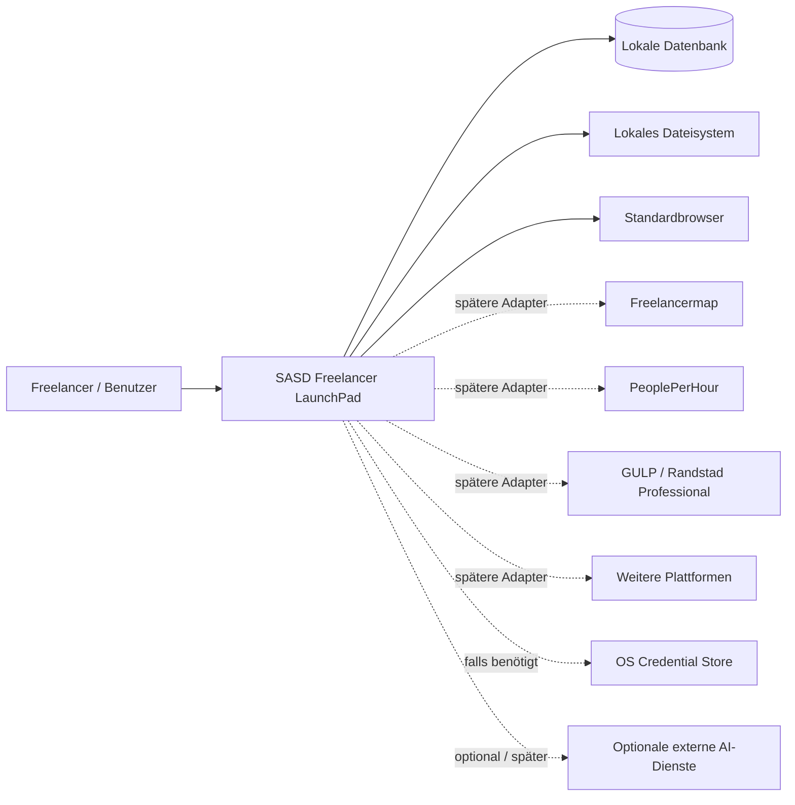
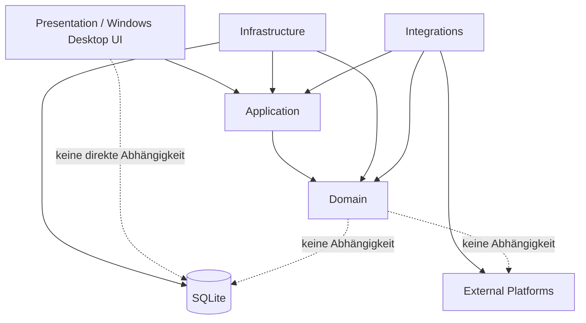
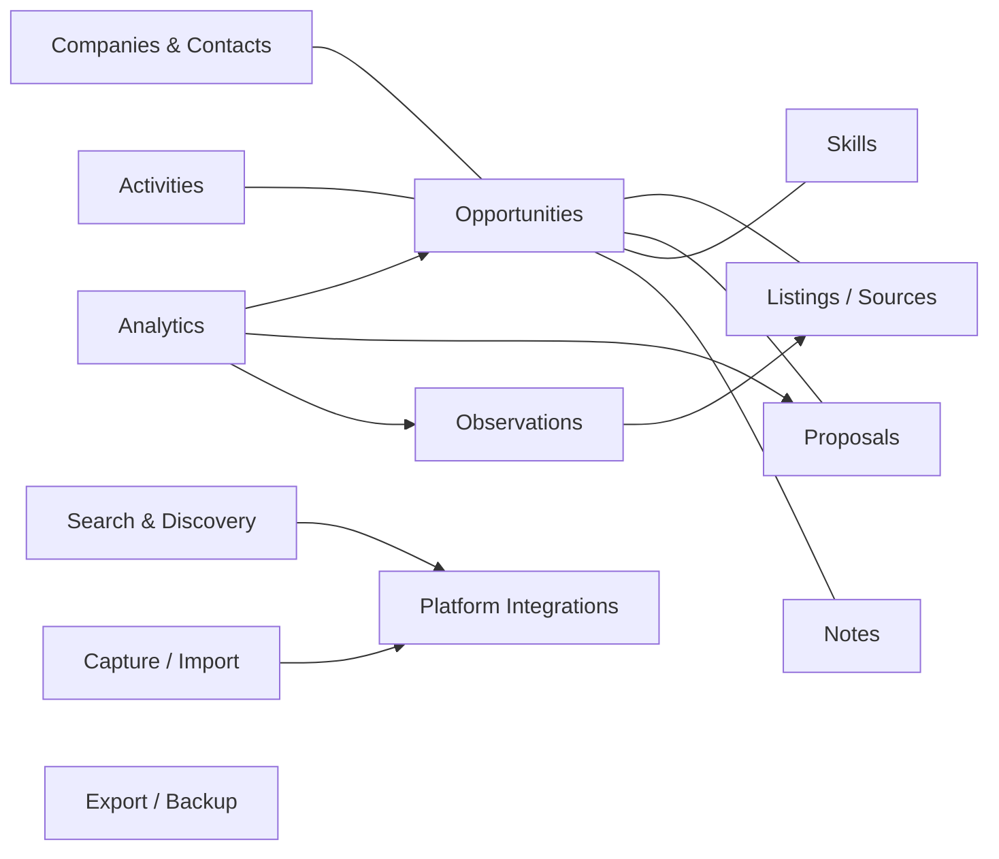
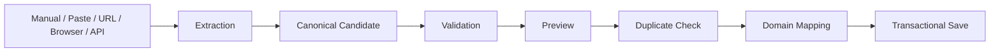
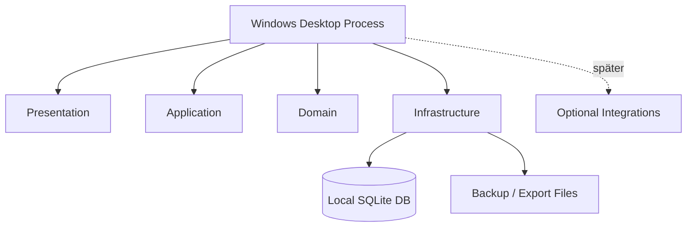
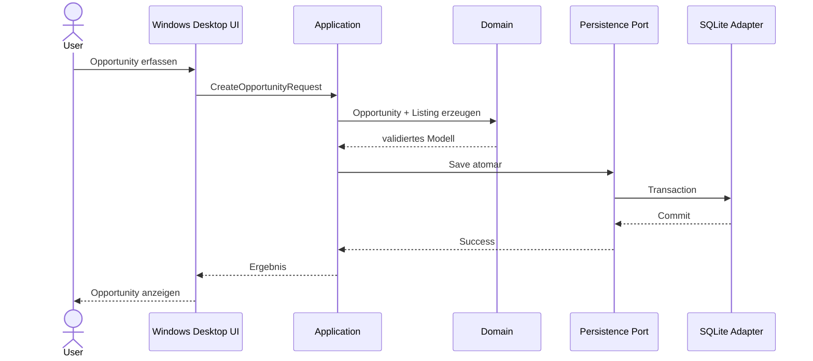
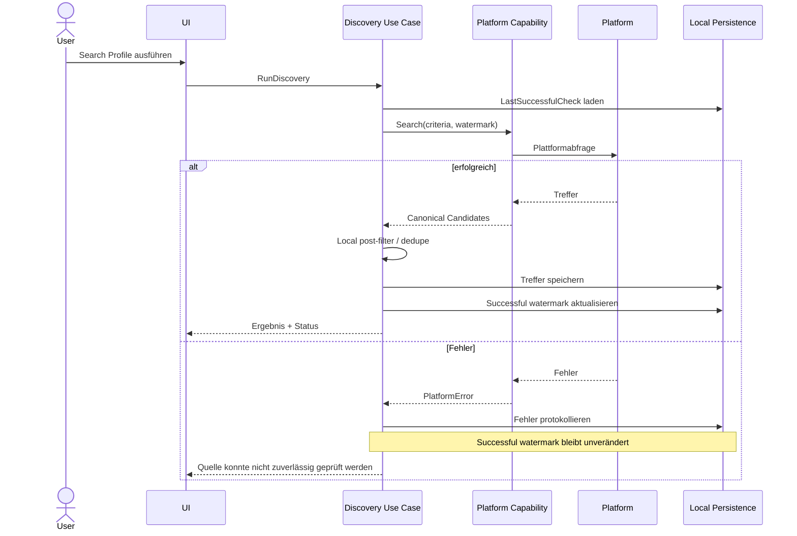
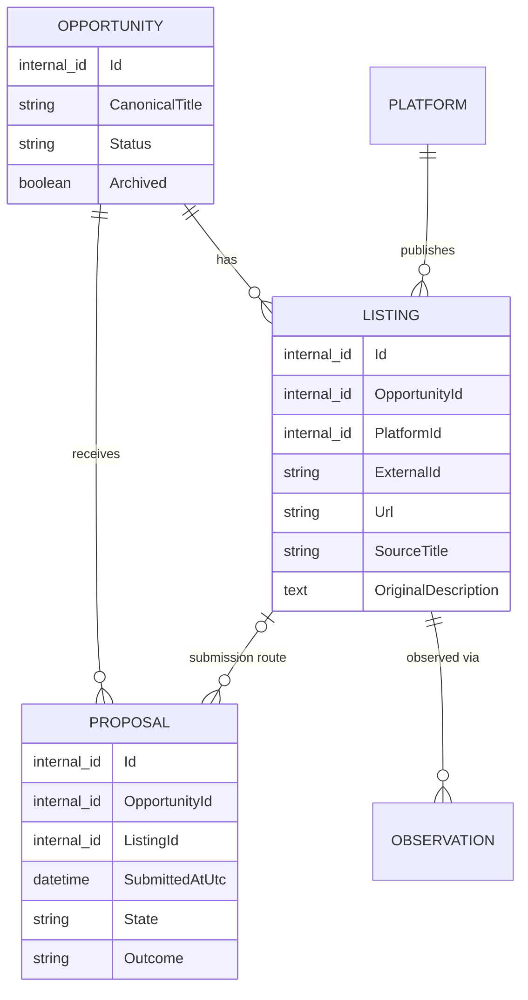
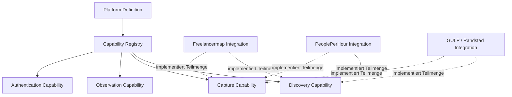

# SASD Freelancer LaunchPad – Architecture

**Version:** 0.1  
**Status:** Baseline-Kandidat  
**Projekt:** SASD Freelancer LaunchPad  
**Organisation:** SASD GmbH  
**Dokumenttyp:** Architektur-Dokument  
**Sprache:** Deutsch  
**Stand:** 24.08.2026  
**Führende fachliche Grundlage:** `010_Lastenheft.md` Version 0.2 und `020_Pflichtenheft_MVP.md` Version 0.2

---

# 0. Dokumentkontrolle

## 0.1 Zweck dieses Dokuments

Dieses Dokument definiert die **langfristigen Architekturgrenzen, Verantwortlichkeiten, Abhängigkeitsregeln und strukturellen Leitentscheidungen** von SASD Freelancer LaunchPad.

Es beantwortet insbesondere:

> **Wie muss LaunchPad strukturell aufgebaut sein, damit der kleine frühe Produktstand zuverlässig umgesetzt werden kann und spätere Produktbereiche ergänzt werden können, ohne das Kernsystem grundlegend neu aufzubauen?**

Das Dokument ist bewusst detaillierter als Lasten- und Pflichtenheft, bleibt aber oberhalb konkreter Implementierungsdetails wie:

- exakter Klassenname,
- konkrete SQL-DDL,
- Control-Namen in konkretes UI-Framework,
- konkrete NuGet-Pakete,
- konkrete Parserbibliotheken,
- konkrete Release-Reihenfolge.

Solche Details gehören in:

- `030_Technical_Design.md`,
- `040_Database_Design.md`,
- ADRs,
- Roadmap,
- Code.

---

## 0.2 Führende Dokumentationsorte

| Thema | Führender Ort |
|---|---|
| Produktziel, Anforderungen, Scope | `010_Lastenheft.md` |
| MVP-Verhalten und Abnahme | `020_Pflichtenheft_MVP.md` |
| konkrete technische Umsetzung des aktuellen Stands | `030_Technical_Design.md` |
| persistentes Schema, Tabellen, Indizes, Migrationen | `040_Database_Design.md` |
| langfristige Architekturgrenzen und Abhängigkeitsregeln | `050_Architecture.md` |
| Entwicklungsreihenfolge | `060_Product_Roadmap.md` |
| Begründung einzelner Architekturentscheidungen | ADRs |
| Datenschutzkonkretisierung | `080_Data_Protection.md` |

Eine Entscheidung soll nicht unnötig in mehreren Dokumenten vollständig dupliziert werden.

---

## 0.3 Normative Sprache

In diesem Dokument bedeuten:

- **MUSS**: verbindliche Architekturregel.
- **DARF NICHT**: verbindliches Architekturverbot.
- **SOLL**: starke Empfehlung; Abweichung benötigt Begründung.
- **KANN**: zulässige Option.
- **SPÄTER**: strukturell vorgesehen, aber derzeit nicht zu implementieren.

---

## 0.4 Architekturgrundsatz

Der zentrale Architekturgrundsatz lautet:

> **Für die Zukunft offen bleiben, ohne die Zukunft auf Vorrat zu implementieren.**

Daraus folgen zwei gleich wichtige Regeln:

1. Der frühe MVP darf nicht durch unnötige Enterprise-, AI-, Plugin-, Cloud- oder Multi-User-Infrastruktur aufgebläht werden.
2. Der frühe MVP darf keine strukturellen Kurzschlüsse einbauen, die bereits bekannte spätere Produktanforderungen unnötig blockieren.

---

# 1. Architekturtreiber

## 1.1 Fachliche Treiber

Die Architektur wird insbesondere durch folgende fachliche Eigenschaften bestimmt:

1. eine `Opportunity` ist das reale potentielle Projekt;
2. eine Opportunity kann mehrere `Listings` / Fundstellen auf unterschiedlichen Plattformen besitzen;
3. Plattformen unterscheiden sich deutlich in Datenmodell und Fähigkeiten;
4. Proposal ist ein eigenes fachliches Objekt;
5. Opportunity-Status und Archivierung sind getrennt;
6. externe Marktdaten sollen später historisch beobachtbar sein;
7. fehlende oder unbekannte externe Daten sind normal;
8. Preise und Rates besitzen unterschiedliche Einheiten und dürfen nicht stillschweigend ineinander umgerechnet werden;
9. Search Profiles und zuverlässige Discovery werden später zentral;
10. das Produkt bleibt local-first;
11. externe Plattformfehler dürfen die lokale Anwendung nicht blockieren;
12. die Datenbasis soll über Jahre wachsen und wertvoller werden.

---

## 1.2 Technische Treiber

Technische Treiber sind:

- Windows Desktop als erste Zielumgebung,
- lokale persistente Datenhaltung,
- Einzelanwenderbetrieb als Ausgangspunkt,
- robuste Offline-Funktion lokaler Features,
- erweiterbare Plattformintegration,
- versionierte Schema-Migration,
- testbare Fachlogik,
- gute Wartbarkeit,
- verständlicher Code,
- geringe Hintergrundlast,
- klare Fehlerisolation.

---

## 1.3 Qualitätsziele

Priorisierte Qualitätsziele:

| Priorität | Qualitätsziel | Bedeutung |
|---|---|---|
| 1 | Datenintegrität | Keine stillen Datenverluste oder fachlich widersprüchlichen Zustände |
| 2 | Wartbarkeit | Änderungen sollen lokal begrenzt bleiben |
| 3 | Erweiterbarkeit | neue Plattformen und spätere Produktmodule ohne Kernumbau |
| 4 | Nachvollziehbarkeit | fachliche Entscheidungen und Datenherkunft sollen verständlich bleiben |
| 5 | Zuverlässigkeit | externe Fehler dürfen lokale Arbeit nicht verhindern |
| 6 | Testbarkeit | Fachlogik soll ohne UI/DB/Internet testbar sein |
| 7 | Bedienbarkeit | Architektur darf kurze UI-Workflows nicht behindern |
| 8 | Ressourceneffizienz | kein unnötiger Dauerverbrauch |

---

# 2. Systemkontext

## 2.1 Systemgrenze

LaunchPad ist zunächst eine lokale Windows-Desktop-Anwendung.

Innerhalb der Systemgrenze liegen:

- Benutzeroberfläche,
- Application Use Cases,
- Domain Model,
- lokale Persistenz,
- Suche/Filter,
- Backup/Export,
- später Plattformintegration,
- später Discovery,
- später Observation,
- später Analytics.

Außerhalb liegen:

- Freelancer-Portale,
- Browser,
- externe APIs,
- Plattform-Login,
- externe AI-Dienste,
- E-Mail-Systeme,
- Betriebssystem-Credential-Store,
- Backup-Zielmedien.

---

## 2.2 Kontextdiagramm



---

## 2.3 Systemverantwortung

LaunchPad ist verantwortlich für:

- lokale Strukturierung,
- lokale Wiederauffindbarkeit,
- fachliche Verknüpfung,
- Benutzerentscheidungen,
- persistente Historie,
- nachvollziehbare Integration externer Daten.

LaunchPad ist **nicht** verantwortlich für:

- Verfügbarkeit externer Plattformen,
- Korrektheit fremder Inhalte,
- Zahlungsabwicklung,
- Projektabwicklung,
- Portal-Loginverfahren,
- externe Vertragsbeziehungen.

---

# 3. Architekturform

## 3.1 Modularer Monolith

**ARCH-001 – Modularer Monolith**

LaunchPad MUSS zunächst als **modularer Monolith** entwickelt werden.

Das bedeutet:

- ein Desktop-Produkt,
- ein primärer Prozess,
- eine lokale Datenbasis,
- logisch getrennte Module,
- keine Microservice-Landschaft.

Begründung:

- Einzelanwenderprodukt,
- geringe Deployment-Komplexität,
- lokale Daten,
- einfache Debugbarkeit,
- deutlich geringere Betriebs- und Testkomplexität.

---

## 3.2 Keine Microservices

**ARCH-002 – Keine verteilte Architektur auf Vorrat**

LaunchPad DARF NICHT allein aus hypothetischen späteren Enterprise-Anforderungen früh in Microservices zerlegt werden.

Eine spätere Auslagerung einzelner Funktionen bleibt möglich, wenn reale Anforderungen dies rechtfertigen.

---

## 3.3 Domain-zentrierte Schichtenarchitektur

**ARCH-003 – Dependency Rule**

Die Architektur MUSS eine nach innen gerichtete Abhängigkeitsregel einhalten.

Konzeptionell:

```text
Presentation
     ↓
Application
     ↓
Domain

Infrastructure ──implements──> Application Ports
Integration    ──implements──> Application Ports
```

Der Domain-Kern kennt:

- kein konkretes UI-Framework,
- kein SQLite,
- kein HTTP,
- keine Plattform-SDKs,
- keine konkreten Dateisystemdetails.

---

## 3.4 Ports and Adapters

**ARCH-004 – Externe Grenzen**

Externe Systeme und technische Infrastruktur SOLLEN über klar definierte Ports/Adapter angebunden werden.

Dies betrifft insbesondere:

- Persistenz,
- Plattformzugriffe,
- Dateisystem,
- Browser,
- Credential Store,
- Uhrzeit,
- Export,
- Backup,
- spätere AI-Dienste.

---

## 3.5 Kein Framework als Architektur

**ARCH-005 – Framework-Unabhängigkeit des Kerns**

Die Facharchitektur DARF NICHT durch ein UI-, ORM-, HTTP- oder Datenbankframework definiert werden.

Frameworks sind Implementierungsdetails der äußeren Schichten.

---

# 4. Schichten und Abhängigkeiten

## 4.1 Überblick



---

## 4.2 Domain Layer

Der Domain Layer enthält:

- fachliche Entitäten,
- Value Objects,
- fachliche Regeln,
- fachliche Zustände,
- Invarianten,
- reine Domain Services, falls erforderlich.

Der Domain Layer enthält NICHT:

- SQL,
- UI-Code,
- HTTP,
- JSON-Parsing externer Plattformen,
- Logging-Framework-Code,
- Dateisystemzugriffe.

---

## 4.3 Application Layer

Der Application Layer orchestriert Use Cases.

Beispiele:

- Opportunity anlegen,
- Opportunity ändern,
- Listing hinzufügen,
- Opportunity archivieren,
- Proposal dokumentieren,
- Suche ausführen,
- Backup erstellen,
- Importvorschau erzeugen,
- später Discovery durchführen.

Der Application Layer:

- koordiniert Transaktionen,
- prüft Berechtigungen/Preconditions,
- verwendet Domain-Objekte,
- spricht Infrastruktur ausschließlich über Ports an.

---

## 4.4 Presentation Layer

Der Presentation Layer:

- zeigt Daten,
- nimmt Benutzereingaben entgegen,
- ruft Application Use Cases auf,
- stellt Fehler verständlich dar.

Er DARF NICHT:

- SQL ausführen,
- Domain-Regeln duplizieren,
- Plattform-HTML parsen,
- Datenbanktransaktionen selbst steuern.

---

## 4.5 Infrastructure Layer

Infrastructure implementiert technische Ports, insbesondere:

- SQLite-Persistenz,
- Dateisystem,
- Backup,
- Export,
- Logging,
- Betriebssystemintegration,
- Systemuhr-Adapter falls benötigt.

---

## 4.6 Integrations Layer

Integrations enthält spätere externe Plattformadapter und Capture-Provider.

Dieser Layer:

- versteht fremde Datenmodelle,
- übersetzt sie in kanonische LaunchPad-Transportmodelle,
- isoliert Fehler externer Systeme,
- darf keine UI-Abhängigkeit besitzen.

---

# 5. Modularchitektur

## 5.1 Zielmodule

Die langfristige logische Modulstruktur lautet:



Nicht alle Module werden sofort implementiert.

---

## 5.2 Modularität ohne Plugin-Overkill

**ARCH-006 – Logische Module**

Produktbereiche SOLLEN logisch getrennte Verantwortungsbereiche besitzen.

**ARCH-007 – Kein frühes Plugin-System**

Ein generisches öffentliches Plugin-System ist NICHT Bestandteil der frühen Architektur.

Erweiterbarkeit wird zunächst durch:

- klare Interfaces,
- modulare Assemblies/Namespaces,
- Dependency Injection,
- Integrationsports

erreicht.

---

# 6. Zentrales Domain Model

## 6.1 Opportunity als reales Projekt

**ARCH-008 – Opportunity-Identität**

Eine `Opportunity` repräsentiert das reale potentielle Projekt bzw. die Auftragschance.

Sie besitzt eine **LaunchPad-interne Identität**, die unabhängig von externen Plattform-IDs ist.

---

## 6.2 Listing / Fundstelle

**ARCH-009 – Listing als quellenspezifische Veröffentlichung**

Ein `Listing` repräsentiert eine konkrete Veröffentlichung einer Opportunity auf einer externen Platform.

Eine Opportunity kann:

```text
1..n Listings
```

besitzen.

Im MVP ist:

```text
1 Opportunity
→ typischerweise 1 Listing
```

zulässig und UI-seitig optimiert.

---

## 6.3 Warum Opportunity und Listing getrennt bleiben müssen

Dasselbe Projekt kann beispielsweise auftreten als:

```text
Opportunity: Linux Migration bei Endkunde X

Listing A:
- Freelancermap
- Vermittler A
- URL A
- 85 €/h
- Beschreibung A

Listing B:
- GULP
- Vermittler B
- URL B
- 95 €/h
- Beschreibung B
```

Eine Zusammenführung aller quellenspezifischen Werte direkt auf Opportunity-Ebene würde Informationen zerstören.

---

## 6.4 Opportunity-Level vs. Listing-Level

Grundregel:

### Opportunity-Level

Daten, die die **eigene fachliche Sicht auf das reale Projekt** darstellen:

- interne Identität,
- eigener kanonischer Titel,
- Opportunity Status,
- Archivierung,
- eigene Notes,
- eigene Bewertung,
- Dismiss Reason,
- gegebenenfalls bekannter Endkunde,
- später verknüpfte Companies/Contacts,
- aggregierte bzw. normalisierte Skills.

### Listing-Level

Daten, die aus einer **konkreten Quelle** stammen:

- Platform,
- External ID,
- URL,
- Originaltitel,
- Originalbeschreibung,
- PublishedAt,
- source-spezifisches Budget,
- source-spezifische Hourly Rate,
- source-spezifische Daily Rate,
- source-spezifischer Remote-Anteil,
- source-spezifischer Ort,
- source-spezifische Laufzeit,
- source-spezifischer Vermittler,
- Capture Method,
- CapturedAt,
- Source Provenance.

---

## 6.5 Keine erzwungene Verdopplung

**ARCH-010 – Kanonische Werte nur bei echtem Nutzen**

Die Architektur DARF NICHT automatisch jedes Listing-Feld zusätzlich auf Opportunity-Ebene duplizieren.

Kanonische oder abgeleitete Opportunity-Werte werden nur eingeführt, wenn ein konkreter Use Case sie benötigt.

---

## 6.6 Unsichere Gleichheit zweier Listings

**ARCH-011 – Kein automatisches aggressives Merge**

Wenn nicht sicher ist, ob zwei Listings dasselbe reale Projekt beschreiben, DARF das System sie nicht automatisch zu einer Opportunity verschmelzen.

Zulässig sind später:

- Duplicate Candidate,
- Possible Same Opportunity,
- Benutzerbestätigung,
- manuelles Merge mit nachvollziehbarer Datenbehandlung.

---

# 7. Aggregate und Konsistenzgrenzen

## 7.1 Pragmatismus statt DDD-Zeremonie

LaunchPad verwendet Domain-Modellierung, aber keine unnötige DDD-Komplexität.

Aggregate dienen nur dort als Konsistenzgrenzen, wo dies fachlich sinnvoll ist.

---

## 7.2 Opportunity Aggregate

Konzeptionell ist `Opportunity` eine zentrale Konsistenzgrenze für:

- Status,
- Archivierung,
- zentrale Benutzerentscheidung,
- Zuordnung ihrer Listings.

Die konkrete Persistenzstruktur entscheidet `040_Database_Design.md`.

---

## 7.3 Listing

Ein Listing MUSS genau einer Opportunity zugeordnet sein.

Ein Listing MUSS genau eine Platform besitzen.

Eine externe Platform-ID ist keine globale LaunchPad-Identität.

---

## 7.4 Proposal Aggregate

**ARCH-012 – Proposal separat**

Proposal ist eine eigenständige fachliche Konsistenzgrenze.

Ein Proposal:

- gehört zu genau einer Opportunity,
- KANN auf das Listing verweisen, über das die Bewerbung abgegeben wurde,
- besitzt eigene Rate-/Preisangaben,
- besitzt eigenen Zustand,
- besitzt gegebenenfalls terminales Outcome.

---

## 7.5 Observation Aggregate

Observations werden langfristig separat gespeichert.

Grund:

- potenziell viele Zeitpunkte,
- andere Lebensdauer,
- andere Schreibfrequenz,
- Analysebedarf.

Externe Markt-Observations SOLLEN möglichst einem Listing zugeordnet werden.

---

## 7.6 Search Profile

Search Profile ist später eine eigenständige fachliche Einheit.

Es darf nicht direkt als Plattform-spezifisches Suchformular modelliert werden.

---

# 8. Fachliche Invarianten

## 8.1 Opportunity Status vs. Archivierung

**ARCH-013**

`Archived` DARF NICHT als Opportunity Status implementiert werden.

Beispiel:

```text
Status = Dismissed
Archived = true
```

ist gültig.

---

## 8.2 Opportunity vs. Proposal

**ARCH-014**

`Applied`, `Won`, `Rejected` oder vergleichbare Proposal-Zustände DARF NICHT als Ersatz für ein Proposal-Objekt verwendet werden.

---

## 8.3 Outcome

**ARCH-015**

Ein Proposal Outcome DARF nur existieren, wenn ein Proposal existiert.

Terminale Outcomes sind fachlich von Zwischenereignissen wie Interview oder Offer zu trennen.

---

## 8.4 TimedOutByUser

**ARCH-016**

`TimedOutByUser` bedeutet:

> Der Nutzer betrachtet das Proposal für seinen Workflow als beendet.

Es behauptet NICHT, dass die externe Plattform oder der Auftraggeber eine Absage erteilt hat.

---

## 8.5 Unknown ist gültig

**ARCH-017 – Keine Sentinel-Werte**

Unbekannte externe Werte sind gültig.

Sie dürfen NICHT durch künstliche Werte wie:

```text
0
-1
"unknown"
01.01.1900
```

ersetzt werden, wenn dadurch echte Werte und fehlende Daten nicht mehr unterscheidbar sind.

---

## 8.6 Notes

**ARCH-018**

User Notes und externe Originaltexte sind getrennte Informationsarten.

Ein Import DARF User Notes niemals stillschweigend überschreiben.

---

# 9. Zeitarchitektur

## 9.1 UTC als kanonische Zeitbasis

**ARCH-019 – UTC Storage**

Persistierte und intern verglichene Zeitpunkte SOLLEN kanonisch als UTC-Zeitpunkte behandelt werden.

Bis eine konfigurierbare Zeitzonenanzeige implementiert ist, darf die UI UTC sichtbar anzeigen.

---

## 9.2 Keine implizite lokale Zeit im Domain-Kern

Domain- und Application-Logik SOLLEN nicht von der lokalen Windows-Zeitzone abhängen.

---

## 9.3 Externe Zeitangaben

Plattformdaten können liefern:

- UTC,
- Zeit mit Offset,
- lokale Zeit ohne Offset,
- nur Datum,
- relative Angabe wie „vor 3 Stunden“.

Adapter müssen Unsicherheit erhalten.

Ein Adapter DARF NICHT eine nicht bekannte Zeitzone erfinden.

---

## 9.4 Clock Port

**ARCH-020 – Testbare Zeit**

Application Use Cases, die „jetzt“ benötigen, SOLLEN eine abstrahierte Uhr verwenden.

Dadurch sind Tests deterministisch.

Der konkrete technische Typ wird im Technical Design festgelegt.

---

# 10. Money-, Budget- und Rate-Architektur

## 10.1 Getrennte Konzepte

**ARCH-021 – Keine Universal-Rate**

Folgende Werte bleiben getrennt:

- Fixed Budget,
- Hourly Rate,
- Daily Rate,
- Own Proposed Fixed Price,
- Own Proposed Hourly Rate,
- Own Proposed Daily Rate,
- spätere Winning Rate.

---

## 10.2 Money Value

Ein monetärer Wert benötigt mindestens:

- Amount,
- Currency.

Ein Rate-Wert benötigt zusätzlich eine Einheit.

---

## 10.3 Keine implizite Umrechnung

**ARCH-022**

Hourly, Daily und Fixed DARF NICHT stillschweigend ineinander umgerechnet werden.

Auch Währungsumrechnungen sind abgeleitete Werte.

---

## 10.4 Explizite Annahmen

Spätere Umrechnungen müssen ihre Annahmen kennen.

Beispiel:

```text
Daily Rate: 800 EUR/day
Assumption: 8 hours/day
Derived Hourly Rate: 100 EUR/hour
```

Der abgeleitete Wert DARF den Originalwert nicht ersetzen.

---

## 10.5 Rabatte und Konditionen

Die Architektur darf nicht voraussetzen:

```text
List Rate = Proposal Rate = Effective Rate
```

Rabatte, Plattformgebühren und Verhandlung können Werte verändern.

---

# 11. Application Architecture

## 11.1 Use-Case-orientierte Schnittstelle

Die UI spricht nicht mit Repositories direkt.

Sie ruft Use Cases auf.

Beispiele:

```text
CreateOpportunity
UpdateOpportunity
AddListing
ArchiveOpportunity
RestoreOpportunity
DeleteOpportunity
SearchOpportunities
RecordProposal
UpdateProposal
CreateBackup
ExportData
```

---

## 11.2 Commands und Queries ohne CQRS-Zwang

**ARCH-023**

Schreibende und lesende Use Cases dürfen getrennt strukturiert werden.

LaunchPad benötigt jedoch kein vollständiges CQRS-Framework.

---

## 11.3 Validierung

Validierung erfolgt in drei Stufen:

### Presentation

Einfache Eingabehilfe:

- Pflichtfeld sichtbar,
- Format-Hinweis,
- unmittelbare UI-Rückmeldung.

### Application

Use-Case-Preconditions:

- Objekt vorhanden?
- abhängige Objekte zulässig?
- Duplikatprüfung?

### Domain

harte fachliche Invarianten.

---

## 11.4 Transaktionen

**ARCH-024 – Use Case als Transaktionsgrenze**

Eine fachlich atomare Benutzeraktion SOLL auch persistent atomar sein.

Beispiel:

```text
Create Opportunity
+ Create first Listing
```

darf nicht in einem Zustand enden, in dem nur die Hälfte gespeichert wurde.

---

# 12. Presentation Architecture

## 12.1 Windows-first

Die erste Präsentationsschicht ist Windows Desktop.

Das konkrete UI-Framework wird im Technical Design geführt.

---

## 12.2 Passive UI

**ARCH-025 – Keine Fachlogik im Form-Code**

Forms/Controls sollen möglichst wenig Fachlogik enthalten.

Die UI:

- sammelt Eingaben,
- zeigt View Models,
- ruft Use Cases,
- zeigt Ergebnisse und Fehler.

---

## 12.3 Presenter/ViewModel Pattern

Für komplexere Screens SOLL eine klare Trennung zwischen:

- View,
- Presenter/ViewModel,
- Application Services

bestehen.

Das genaue Pattern darf im Technical Design gewählt werden.

---

## 12.4 UI darf das Domain Model nicht verbiegen

Die Tatsache, dass der MVP zunächst eine Fundstelle pro Opportunity zeigt, DARF NICHT zu einer dauerhaften fachlichen 1:1-Modellierung führen.

---

## 12.5 1280 × 720

Die UI-Architektur muss Layouts ermöglichen, die mindestens bei 1280 × 720 sinnvoll nutzbar bleiben.

Dies beeinflusst:

- Navigation,
- Dialoggrößen,
- Detailansichten,
- progressive Offenlegung.

---

# 13. Persistenzarchitektur

## 13.1 Local-first Persistence

**ARCH-026**

Die kanonische persönliche LaunchPad-Datenbasis liegt zunächst lokal.

---

## 13.2 SQLite als aktuelle Persistenztechnologie

Die aktuell geplante lokale Persistenz ist SQLite.

Die konkrete Schemaausgestaltung gehört in `040_Database_Design.md`.

---

## 13.3 Keine Datenbank-Abstraktion um ihrer selbst willen

**ARCH-027**

LaunchPad soll keine generische `IRepository<T>`-Architektur nur für theoretische Datenbankwechsel erzwingen.

Bevorzugt werden fachlich sprechende Ports, beispielsweise konzeptionell:

```text
IOpportunityRepository
IProposalRepository
ISearchProfileRepository
```

Die exakten Namen gehören ins Technical Design.

---

## 13.4 Keine SQL-Leaks

SQL-Details dürfen nicht in:

- Domain,
- Presentation

gelangen.

---

## 13.5 Schema-Migrationen

**ARCH-028**

Persistenzschemaänderungen müssen versioniert migrierbar sein.

Nach dem frühen Prototypstadium ist:

> Datenbank löschen und neu beginnen

kein regulärer Upgrade-Mechanismus.

---

## 13.6 Datenbankversion vs. Produktversion

Schema-Version und Produktversion sind getrennte Konzepte.

---

## 13.7 Indexierung

Such- und Filteranforderungen dürfen passende Datenbankindizes bzw. spätere Volltextindizes verwenden.

Die konkrete Indexstrategie gehört ins Database Design.

---

# 14. Konsistenz und Nebenläufigkeit

## 14.1 Ausgangsmodell

Die frühe Architektur geht aus von:

- einem lokalen Benutzer,
- einem primären Desktop-Prozess,
- keiner verteilten Multi-User-Bearbeitung.

---

## 14.2 Hintergrundaufgaben

Spätere Discovery- oder Observation-Jobs können im selben Prozess asynchron laufen.

Sie dürfen UI-Threads nicht blockieren.

---

## 14.3 Schreibzugriffe

**ARCH-029**

Schreibzugriffe aus UI und Background Jobs müssen über dieselben Application Use Cases bzw. Konsistenzregeln laufen.

Ein Background Adapter darf nicht „hinter dem Rücken“ der Application direkt Domain-Tabellen manipulieren.

---

## 14.4 Keine verteilte Konsistenz auf Vorrat

Die frühe Architektur benötigt keine:

- Distributed Locks,
- Message Broker,
- Saga-Infrastruktur,
- verteilte Transaktionen.

---

# 15. Search Architecture

## 15.1 Local Search

Local Search arbeitet ausschließlich auf der lokalen LaunchPad-Datenbasis.

Sie funktioniert offline.

---

## 15.2 External Discovery

External Discovery ist davon getrennt.

Sie verwendet externe Quellen und kann fehlschlagen.

---

## 15.3 Kanonisches Filtermodell

**ARCH-030**

Search Profiles SOLLEN ein LaunchPad-eigenes, plattformunabhängiges Filtermodell verwenden.

Beispiele:

- Keywords,
- Skills,
- Zeitfenster,
- Remote,
- Rate,
- Ort,
- Ausschlüsse.

---

## 15.4 Quellfilter und Post-Filter

Ein Adapter darf den Teil eines Search Profiles an die Platform übertragen, den diese unterstützt.

Danach kann LaunchPad lokal nachfiltern.

Beispiel:

```text
LaunchPad:
since 2026-08-23 14:00 UTC

Freelancermap:
nur "letzte 24h" verfügbar

Ablauf:
1. Plattformfilter 24h
2. Treffer importieren
3. lokal präzise seit 14:00 UTC filtern
```

---

## 15.5 Unbekannte Werte

Search-Logik darf unbekannte Werte nicht automatisch als Null oder negativ interpretieren.

Wie einzelne Filter mit `unknown` umgehen, ist eine explizite Filtersemantik.

---

# 16. Platform Integration Architecture

## 16.1 Adaptergrenze

**ARCH-031 – Platform Adapter Boundary**

Jede Platform-Integration MUSS außerhalb des Domain-Kerns liegen.

---

## 16.2 Capability-basierte Integration

Eine Platform ist nicht einfach:

```text
supported = true/false
```

Sie kann unterschiedliche Capabilities besitzen.

Konzeptionell:

```text
Platform Integration
 ├── Capture Capability
 ├── Discovery Capability
 ├── Observation Capability
 ├── Authentication Capability
 └── Metadata / Health Capability
```

---

## 16.3 Keine riesige Alleskönner-Schnittstelle

**ARCH-032**

Ein Adapter SOLL nicht gezwungen werden, Methoden für Fähigkeiten zu implementieren, die seine Plattform nicht besitzt.

Daher sind kleine Capability-Ports einem gigantischen `IPlatformAdapter` vorzuziehen.

Die konkreten Interface-Namen werden im Technical Design festgelegt.

---

## 16.4 Kanonisches Integrationsmodell

Externe Plattformobjekte dürfen nicht direkt Domain-Entitäten werden.

Adapter liefern zunächst ein kanonisches Transport-/Capture-Modell.

Konzeptionell:

```text
Platform HTML/API
      ↓
Platform Adapter
      ↓
External Listing Candidate
      ↓
Validation / Preview / Normalization
      ↓
Application Use Case
      ↓
Opportunity + Listing
```

---

## 16.5 Fremde DTOs bleiben draußen

**ARCH-033**

Plattform-spezifische DTOs, JSON-Modelle oder HTML-DOM-Strukturen dürfen die Integrationsgrenze nicht überschreiten.

---

## 16.6 Fehlerisolation

Adapterfehler werden in platform-spezifische Fehlerzustände übersetzt.

Sie dürfen:

- lokale Daten,
- andere Adapter,
- lokale Suche

nicht blockieren.

---

## 16.7 Credentials

Plattform-Credentials gehören nicht in Domain-Objekte und nicht als Klartext in die normale Datenbank.

Spätere Authentifizierung nutzt bevorzugt:

- Browser Session,
- OAuth,
- API Token,
- OS Credential Store.

---

# 17. Discovery Architecture

## 17.1 Discovery als orchestrierter Use Case

Discovery wird durch Application Services orchestriert.

Ein Adapter liefert Treffer.

Die Application entscheidet:

- neu?
- bereits bekannt?
- möglicher Duplicate Candidate?
- speichern?
- lokale Nachfilterung?

---

## 17.2 Discovery Watermark

**ARCH-034 – Erfolgsmarker pro Search Profile und Platform**

Der letzte erfolgreiche Discovery-Stand muss mindestens logisch pro:

```text
SearchProfile × Platform
```

geführt werden.

---

## 17.3 Fehler dürfen Watermark nicht fortschreiben

**ARCH-035**

Ein fehlgeschlagener oder unvollständiger Discovery-Lauf darf den `LastSuccessfulCheck` nicht so fortschreiben, als wäre die Quelle erfolgreich vollständig geprüft worden.

---

## 17.4 Status eines Discovery-Laufs

Langfristig sinnvoll:

- StartedAt,
- FinishedAt,
- Result Status,
- New Count,
- Existing Count,
- Error/Warning,
- Watermark vorher/nachher.

Die konkrete Persistenz wird später entschieden.

---

## 17.5 Kein „0 Treffer“ bei technischem Fehler

**ARCH-036**

Technischer Fehler und erfolgreiches Ergebnis mit null Treffern müssen unterschiedliche Zustände sein.

---

## 17.6 Keine aggressive Dauerabfrage

Discovery soll kontrolliert laufen.

Architektur muss ermöglichen:

- manuelle Ausführung,
- spätere geplante Ausführung,
- Backoff,
- Rate-Limit-Beachtung.

---

# 18. Capture- und Importarchitektur

## 18.1 Capture Pipeline

Langfristige Pipeline:



---

## 18.2 Manuelle Eingabe

Manual Capture durchläuft dieselben Application-Regeln wie spätere automatische Imports.

Damit existiert nur eine fachliche Wahrheit.

---

## 18.3 Importvorschau

Automatischer Import soll nicht direkt ungeprüft persistieren, wenn Daten unsicher sind.

Die Preview ist eine Application-/Presentation-Verantwortung, keine Adapterverantwortung.

---

## 18.4 Partial Import

Ein Capture Candidate darf unvollständig sein.

`unknown` ist gültig.

Der Adapter darf keine Daten erfinden, um ein vollständiges Modell vorzutäuschen.

---

## 18.5 Duplicate Check

Eindeutige frühe Signale:

```text
Platform + ExternalId
Canonical URL
```

Komplexe semantische Ähnlichkeit kommt später.

---

# 19. Observation- und Historienarchitektur

## 19.1 Kein Event Sourcing

**ARCH-037 – Explicit History statt Event Sourcing**

LaunchPad verwendet kein Event Sourcing als allgemeine Persistenzstrategie.

Historie wird explizit dort modelliert, wo sie Produktwert besitzt.

---

## 19.2 Observation

Observation dient extern beobachtbaren Veränderungen.

Beispiele:

- Listing noch offen?
- Rate geändert?
- Proposal Count geändert?
- Award sichtbar?

---

## 19.3 Domain Events sind trotzdem erlaubt

Interne Domain Events können später für lose Kopplung sinnvoll sein.

Beispiel:

```text
ProposalSubmitted
OpportunityArchived
```

Dies bedeutet nicht, dass Domain Events die Datenbankwahrheit oder vollständige Historie ersetzen.

---

## 19.4 Keine Historie jedes Tippfehlers

History wird nur für fachlich wertvolle Änderungen aufgebaut.

---

# 20. Proposal Architecture

## 20.1 Eigenständiger Lifecycle

Proposal besitzt einen eigenen Lifecycle.

Opportunity darf unabhängig davon:

- Watching,
- Closed,
- Archived

sein.

---

## 20.2 Proposal und Listing

**ARCH-038**

Ein Proposal SOLL optional das konkrete Listing referenzieren können, über das es abgegeben wurde.

Dies ist bei mehreren Vermittlungswegen entscheidend.

---

## 20.3 Proposal Preis

Proposal Preis/Rate gehört niemals in das Listing.

Listing enthält ausgeschriebene Konditionen.

Proposal enthält das eigene Angebot.

---

## 20.4 CV-/Profilversion

Im MVP genügt eine logische Referenz:

```text
CV Linux DevOps 2026-08
```

Es besteht keine Architekturpflicht für ein Dokumentenmanagementsystem.

---

# 21. Company, Contact und Activity – spätere Erweiterung

## 21.1 Keine Textfeld-Sackgasse

Die frühe Architektur soll Company/Contact nicht so tief als unstrukturierte Strings fest verdrahten, dass spätere Entitäten unmöglich werden.

---

## 21.2 Trotzdem kein frühes CRM

**ARCH-039**

Company, Contact und Activity werden nicht allein zur Zukunftsvorsorge vollständig im MVP implementiert.

---

## 21.3 Listing-Vermittler

Ein Listing kann später auf einen Vermittler verweisen.

Unterschiedliche Listings derselben Opportunity können unterschiedliche Vermittler besitzen.

---

## 21.4 Endkunde

Der Endkunde gehört eher zur realen Opportunity.

Ist die Information unsicher oder nur source-spezifisch behauptet, muss diese Unsicherheit erhalten bleiben.

---

## 21.5 Activities

Activity ist später ein eigenständiges Modell für Ereignisse und geplante Aktionen.

Note bleibt davon getrennt.

---

# 22. Analytics Architecture

## 22.1 Analytics lesen, nicht dominieren

Analytics sind überwiegend read-oriented.

Sie dürfen den operativen Domain-Kern nicht mit vorzeitig berechneten Feldern überladen.

---

## 22.2 Ableiten statt redundant speichern

Funnel-Stufen, Kennzahlen und Aggregationen sollen möglichst aus fachlichen Fakten berechnet werden.

Beispiele:

- Opportunity,
- Proposal,
- Observation,
- Activity,
- Outcome.

---

## 22.3 Materialisierung nur bei Bedarf

Spätere Performance kann:

- Views,
- Cache,
- Materialized Summaries,
- separate Read Models

rechtfertigen.

Dies wird erst bei realem Bedarf eingeführt.

---

## 22.4 Keine AI-Abhängigkeit

Analytics müssen grundsätzlich ohne AI funktionieren.

AI darf später ergänzen, erklären oder zusammenfassen.

---

# 23. Background Processing

## 23.1 Cancellation

Länger laufende Hintergrundaufgaben SOLLEN abbrechbar sein.

---

## 23.2 Keine UI-Manipulation aus Worker-Code

Background Services dürfen UI-Controls nicht direkt ändern.

Ergebnisse werden über Application-/Presentation-konforme Mechanismen bereitgestellt.

---

## 23.3 Graceful Shutdown

Beim Beenden der Anwendung sollen laufende Tasks kontrolliert beendet bzw. sicher abgebrochen werden.

---

## 23.4 Fehlerbegrenzung

Ein fehlerhafter Discovery-Lauf darf nicht den gesamten Hostprozess beenden.

Schwerwiegende unerwartete Fehler werden protokolliert und dem Benutzer verständlich signalisiert.

---

# 24. Backup und Export

## 24.1 Backup als Use Case

Backup wird als expliziter Application Use Case behandelt.

Die UI darf nicht einfach eine Datenbankdatei blind kopieren.

---

## 24.2 Konsistenter Snapshot

**ARCH-040**

Ein Backup muss einen konsistenten Datenbankzustand erzeugen.

Die technische Methode wird im Technical Design festgelegt.

---

## 24.3 Verantwortung für Backup-Medium

Die lokale Desktop-Version verwaltet zunächst nicht:

- USB-Verschlüsselung,
- NAS-Verschlüsselung,
- Enterprise Backup Policy.

Der Benutzer ist für die sichere Aufbewahrung des erzeugten Backup-Pakets verantwortlich.

---

## 24.4 Export ist nicht Backup

Backup und Export sind getrennte Konzepte:

### Backup

Ziel:

> vollständige Wiederherstellung.

### Export

Ziel:

> Austausch / Analyse / Portabilität.

---

## 24.5 Originalausschreibung beim Export

Selektive Exporte SOLLEN später eine einfache Möglichkeit bieten, Originalausschreibungstexte auszuschließen.

Standardmäßige vollständige Backups dürfen sie enthalten.

---

# 25. Security und Datenschutzarchitektur

## 25.1 Local-first reduziert, ersetzt aber nicht Verantwortung

Lokale Speicherung reduziert externe Angriffsflächen.

Sie bedeutet nicht:

> keine Sicherheitsanforderungen.

---

## 25.2 Keine Secrets in Logs

Logs dürfen keine unnötigen:

- Passwörter,
- Tokens,
- vollständigen Proposal-Texte,
- vollständigen Ausschreibungen,
- personenbezogenen Kontaktdetails

enthalten.

---

## 25.3 Credential Port

Wenn später Credentials benötigt werden, erfolgt Zugriff über eine dedizierte technische Grenze.

Domain- und Application-Code erhalten keine Klartextpasswörter als persistente Fachattribute.

---

## 25.4 Externe AI

Spätere externe AI-Integration MUSS eine eigene Adaptergrenze besitzen.

AI darf nicht direkt:

- Datenbanktabellen manipulieren,
- User Notes überschreiben,
- Domain-Entitäten ungeprüft persistieren.

---

## 25.5 Datenschutz-Policy nicht im Domain-Kern verstreuen

Retention und Anonymisierung sollen später über klar definierte Policies/Use Cases umgesetzt werden, nicht als verteilte Ad-hoc-Logik in UI und Repositories.

---

# 26. Fehlerarchitektur

## 26.1 Fehlerklassen

Fehler sollen mindestens konzeptionell unterscheidbar sein:

- Validation Error,
- Domain Conflict,
- Persistence Error,
- External Platform Error,
- Authentication Error,
- Network Error,
- Parsing/Extraction Error,
- Backup/Export Error,
- Unexpected Error.

---

## 26.2 Benutzerfehler vs. Systemfehler

Validierungsfehler werden benutzerfreundlich angezeigt.

Systemfehler werden:

- protokolliert,
- technisch diagnostizierbar,
- ohne unnötige technische Details verständlich dargestellt.

---

## 26.3 Kein leeres Catch

**ARCH-041**

Fehler dürfen nicht stillschweigend verschluckt werden.

---

## 26.4 Retry

Automatische Retries sind nur bei transienten Fehlern sinnvoll.

Ein Parsingfehler aufgrund geänderter Plattformstruktur wird durch zehn sofortige Retries nicht besser.

---

# 27. Logging und Diagnostik

## 27.1 Strukturierte Logs

Logging soll strukturiert genug sein, um später beantworten zu können:

- welcher Use Case?
- welcher Adapter?
- wann?
- erfolgreich?
- welcher technische Fehler?

---

## 27.2 Korrelations-ID

Längerfristige Import-/Discovery-Vorgänge können eine technische Correlation ID erhalten.

Dies ist keine Domain-ID.

---

## 27.3 Adapterdiagnostik

Spätere Adapter sollten Fehler unterscheiden können:

- unavailable,
- authentication required,
- rate limited,
- page format changed,
- partial extraction,
- unexpected response.

---

# 28. Performance und Ressourcen

## 28.1 Keine Premature Optimization

Die Architektur soll keine komplexen Caches oder verteilten Systeme einführen, bevor Messdaten einen Bedarf zeigen.

---

## 28.2 Lokale Suche

Lokale Suche muss mit wachsender Datenmenge responsiv bleiben.

Datenbankindizes und gegebenenfalls Volltextsuche sind bevorzugt gegenüber dem Laden aller Datensätze in den Arbeitsspeicher.

---

## 28.3 Große Originaltexte

Vollständige Ausschreibungstexte können relativ groß sein.

Listenansichten sollen sie nicht unnötig vollständig laden, wenn nur Titel und Metadaten benötigt werden.

---

## 28.4 Hintergrundnetzwerk

Discovery darf keine unnötige Daueraktivität erzeugen.

---

# 29. Extensibility Architecture

## 29.1 Neue Plattform

Eine neue Platform soll im Ideal vor allem erfordern:

1. Platform-Metadaten,
2. Implementierung der vorhandenen Capabilities,
3. Adaptertests,
4. Mapping auf kanonische Capture-/Discovery-Modelle.

Sie soll keine Änderungen im Opportunity-Kern erzwingen.

---

## 29.2 Neue Capability

Neue externe Fähigkeiten werden als zusätzliche Capability ergänzt.

Beispiel:

```text
ObservationCapability
```

statt alle bestehenden Adapter mit unnötigen Stub-Methoden zu ändern.

---

## 29.3 Neue UI

Eine spätere alternative UI darf den Domain-/Application-Kern grundsätzlich wiederverwenden können.

Dies ist kein Versprechen für Linux/Web, sondern eine Entkopplungsregel.

---

## 29.4 Kein Abstraktionsfetisch

**ARCH-042**

Interfaces werden dort eingeführt, wo eine echte Architekturgrenze oder Testnaht existiert.

Nicht jede Klasse benötigt ein Interface.

---

# 30. Testarchitektur

## 30.1 Testpyramide

Bevorzugte Struktur:

```text
viele Domain-/Application-Unit-Tests
        ↓
gezielte Persistence-/Integration-Tests
        ↓
Adapter-Contract-/Fixture-Tests
        ↓
wenige UI-/End-to-End-Tests
```

---

## 30.2 Domain Tests

Ohne:

- SQLite,
- konkretes UI-Framework,
- Netzwerk.

Prüfen:

- Status,
- Archivierung,
- Proposal Outcome,
- Money/Rate,
- Listing-Zuordnung,
- Unknown-Semantik.

---

## 30.3 Application Tests

Prüfen Use Cases mit Test Doubles bzw. isolierter Infrastruktur.

---

## 30.4 Persistence Integration Tests

Müssen die echte SQLite-Implementierung testen, insbesondere:

- Migration,
- Transaktionen,
- Constraints,
- Roundtrip,
- Backup/Restore.

---

## 30.5 Adapter Contract Tests

Spätere Adapter benötigen Tests für:

- Capability-Verhalten,
- Mapping,
- Partial Result,
- Fehlerzustände,
- Fixtures bekannter Plattformantworten.

Live-Tests gegen fremde Plattformen allein sind nicht ausreichend.

---

## 30.6 Architecture Tests

**ARCH-043**

Soweit praktikabel sollen automatisierte Tests verhindern, dass verbotene Abhängigkeiten entstehen.

Beispiele:

- Domain referenziert kein konkretes UI-Framework.
- Domain referenziert nicht SQLite-Pakete.
- Presentation greift nicht auf SQLite Connection zu.
- Platform Adapter referenziert UI nicht.

---

# 31. Deployment- und Laufzeitarchitektur

## 31.1 Früher Laufzeitaufbau



---

## 31.2 Composition Root

Die konkrete Anwendung besitzt einen zentralen Composition Root.

Dort werden:

- Implementierungen,
- Ports,
- Repositories,
- Services,
- Presenters/ViewModels

zusammengesetzt.

---

## 31.3 Dependency Injection

Dependency Injection SOLL explizite Abhängigkeiten unterstützen.

Service Locator und globale mutable Singletons sollen vermieden werden.

---

# 32. Migration vom frühen Project-Prototyp

## 32.1 Altcode ist nicht normative Architektur

Der vorhandene frühe `FreelanceProject`-/`Project`-Code darf nicht die neue Facharchitektur definieren.

---

## 32.2 Fachliche Migration

Ein alter Project-Datensatz kann konzeptionell migriert werden zu:

```text
Old Project
   ↓
Opportunity
   +
First Listing
```

Damit bleibt eine klare Migration möglich.

---

## 32.3 Alte Source-Felder

Daten wie:

- Platform,
- URL,
- externe ID,
- Original Description,
- Published Rate

gehören bei der Migration vorzugsweise in das Listing.

---

## 32.4 Alte Applied-Statuswerte

Falls Altcode einen `Applied`-Status verwendet, darf dieser nicht einfach in Opportunity Status übernommen werden.

Migration muss prüfen, ob daraus:

- Proposal erzeugt,
- oder manuelle Nachprüfung

notwendig ist.

---

## 32.5 Keine Big-Bang-Datenvernichtung

Bestehende Test-/Nutzdaten sollen soweit sinnvoll migrierbar bleiben.

Die konkrete Migration wird im Database Design beschrieben.

---

# 33. Datenmodell-Evolution

## 33.1 Expand-and-Migrate

Bei größeren Modelländerungen ist bevorzugt:

1. neues Modell ergänzen,
2. Daten migrieren,
3. Code umstellen,
4. validieren,
5. alte Struktur entfernen.

---

## 33.2 Keine versteckten Semantikänderungen

Eine Spalte darf nicht einfach denselben Namen behalten, wenn ihre fachliche Bedeutung grundlegend geändert wurde.

---

## 33.3 Migrationen müssen testbar sein

Migrationen werden auf realistischen Testdaten geprüft.

---

# 34. Architekturgrenzen – bewusst nicht vorgesehen

Die Architektur wird derzeit NICHT für folgende Systeme optimiert:

- Microservices,
- Kubernetes Deployment,
- hochverfügbarer Servercluster,
- Multi-Tenant SaaS,
- Echtzeit-Collaboration,
- Enterprise Identity Provider,
- Event Sourcing,
- universeller Message Bus,
- generisches Plugin Marketplace,
- verteilte Datenbank,
- Mobile Backend,
- Blockchain,
- eigene AI-Inferenzplattform.

Eine spätere Produktentscheidung kann einzelne Punkte ändern.

Bis dahin sind sie kein Grund für frühe Komplexität.

---

# 35. Wichtige Trade-offs

## 35.1 Modularer Monolith vs. Microservices

Entscheidung:

> modularer Monolith.

Gewinn:

- Einfachheit,
- lokale Transaktionen,
- leichte Entwicklung,
- Debugbarkeit.

Kosten:

- nicht unabhängig skalierbare Module.

Für den aktuellen Produkttyp ist dies der richtige Trade-off.

---

## 35.2 Domain Model vs. einfache CRUD-Anwendung

Entscheidung:

> domain-zentrierter Kern, aber pragmatisch.

Grund:

Bereits heute existieren fachliche Regeln wie:

- Opportunity ≠ Listing,
- Proposal ≠ Opportunity,
- Archive ≠ Status,
- Hourly ≠ Daily,
- Unknown ≠ 0.

Eine reine CRUD-Struktur würde diese Regeln leicht über UI und SQL verteilen.

---

## 35.3 Abstraktion vs. Verständlichkeit

Entscheidung:

> abstrahiere echte Grenzen, nicht jede Klasse.

---

## 35.4 Historie vs. Speicheraufwand

Entscheidung:

> nur fachlich wertvolle Historie.

Keine Event-Sourcing-Vollhistorie.

---

## 35.5 Zukunftssicherheit vs. Overengineering

Entscheidung:

> bekannte strukturelle Sackgassen vermeiden, zukünftige Features nicht vorimplementieren.

---

# 36. Vorgesehene ADRs

Folgende Entscheidungen sollten separat als ADR dokumentiert werden, wenn die konkrete Umsetzung beginnt:

1. **ADR-001 – Modularer Monolith als Laufzeitarchitektur**
2. **ADR-002 – Opportunity und Listing als getrennte Fachkonzepte**
3. **ADR-003 – Domain/Application/Infrastructure/Presentation Dependency Rule**
4. **ADR-004 – SQLite als lokale Persistenz**
5. **ADR-005 – Platform Integration über Capability Ports**
6. **ADR-006 – UTC als kanonische Zeitbasis**
7. **ADR-007 – Kein Event Sourcing**
8. **ADR-008 – Proposal als eigenes Aggregat**
9. **ADR-009 – Opportunity Status getrennt von Archivierung**
10. **ADR-010 – Schema Migration Strategy**
11. **ADR-011 – Credential Storage Strategy**
12. **ADR-012 – Backup Consistency Strategy**

Das Architecture-Dokument legt die Richtung fest.

ADRs dokumentieren später die konkrete Entscheidung einschließlich Alternativen und Begründung.

---

# 37. Architektur-Compliance-Checkliste

Eine Änderung ist architektonisch kritisch zu prüfen, wenn sie eine der folgenden Fragen mit „Ja“ beantwortet:

## Domain

- Importiert Domain ein UI-Framework?
- kennt Domain SQLite oder SQL?
- kennt Domain HTTP oder HTML?
- wird Platform-spezifisches Modell zum Domain-Modell?
- wird `Archived` wieder Opportunity-Status?
- wird Proposal wieder zu einem Opportunity-Feld?

## Presentation

- greift UI direkt auf Datenbank zu?
- enthält Form-Code fachliche Statusregeln?
- parst UI externe Plattformseiten?
- steuert UI Transaktionen?

## Persistence

- wird Schema ohne Migration geändert?
- wird `unknown` als künstlicher Zahlenwert gespeichert?
- werden Hourly/Daily/Fixed vermischt?
- wird External ID als globale Opportunity-ID missbraucht?

## Integration

- überschreibt Adapter User Notes?
- schreibt Adapter direkt in DB?
- kennt Adapter Windows Desktop UI?
- wird Fehler als „0 Treffer“ dargestellt?
- wird Discovery-Watermark trotz Fehler fortgeschrieben?

## Architecture

- wird neue Infrastruktur nur für einen hypothetischen Zukunftsfall eingeführt?
- entsteht eine neue bidirektionale Modulabhängigkeit?
- wird eine fachliche Entscheidung in mehreren Dokumenten redundant gepflegt?

Wenn eine dieser Fragen mit „Ja“ beantwortet wird, soll die Änderung vor Merge überprüft werden.

---

# 38. Konzeptionelle Abhängigkeitsmatrix

| Von | Darf abhängen von | Darf nicht direkt abhängen von |
|---|---|---|
| Domain | Domain | Presentation, Infrastructure, Integrations, DB, HTTP |
| Application | Domain, Application Ports | konkretes UI-Framework, SQLite-Implementierung, Plattform-SDK |
| Presentation | Application, Presentation Models | SQLite, HTTP-Adapter, Plattformparser |
| Infrastructure | Application Ports, Domain | Presentation |
| Integrations | Application Ports, kanonische Integrationsmodelle | Presentation, konkrete DB |
| Tests.Domain | Domain | produktive DB/Netzwerk |
| Tests.Integration | Application/Infrastructure nach Testzweck | — |

---

# 39. Architekturbeispiel – manueller MVP-Workflow



Wichtig:

- UI kennt kein SQL.
- Domain kennt kein SQLite.
- Opportunity und erstes Listing werden atomar gespeichert.

---

# 40. Architekturbeispiel – spätere Discovery



---

# 41. Architekturbeispiel – mehrere Listings einer Opportunity



Dieses Diagramm ist **konzeptionell**.

Tabellen- und Datentypdetails gehören in `040_Database_Design.md`.

---

# 42. Architekturbeispiel – Integrations-Capabilities



Nicht jede Integration muss jede Capability besitzen.

---

# 43. Was das Technical Design jetzt konkretisieren muss

Nach Freigabe dieser Architektur muss `030_Technical_Design.md` insbesondere festlegen:

1. konkrete .NET-Version,
2. konkrete Projekt-/Assembly-Struktur,
3. konkrete Namespace-Regeln,
4. konkretes UI-Pattern,
5. konkrete Dependency-Injection-Konfiguration,
6. konkrete Application-Service-Struktur,
7. konkrete Repository-Interfaces,
8. konkretes Fehler-/Result-Modell,
9. konkrete Logging-Technik,
10. konkreter Zeittyp,
11. konkrete Money-/Rate-Value-Objects,
12. konkrete Background-Service-Technik,
13. konkrete Composition Root.

Das Technical Design darf diese Architektur konkretisieren, aber nicht gegen die Dependency Rule verstoßen.

---

# 44. Was das Database Design jetzt konkretisieren muss

`040_Database_Design.md` muss auf Basis dieser Architektur neu geprüft werden.

Insbesondere sind sauber zu modellieren:

- Opportunity,
- Listing,
- Platform,
- Opportunity Status,
- Archived Flag/ArchivedAt,
- Skills,
- Notes,
- Proposal,
- Proposal State,
- Proposal Outcome,
- Money/Rate-Felder,
- UTC-Zeiten,
- Schema Version,
- später Search Profile,
- später Observation,
- später Company,
- später Contact,
- später Activity.

Wesentlich:

> Das Database Design darf `Opportunity` und `Listing` nicht wieder in eine einzige `projects`-Tabelle mit widersprüchlicher Semantik zurückfalten.

---

# 45. Offene Architekturentscheidungen

Die folgenden Punkte sind bewusst noch offen und werden erst entschieden, wenn Technical Design oder reale Nutzung dies erfordern:

1. genaue Assembly-Anzahl,
2. genaue Interface-Namen,
3. Record/Entity/ValueObject-Implementierung in C#,
4. konkrete ORM-/ADO.NET-Strategie,
5. konkrete Volltextsuchtechnik,
6. konkrete Backup-Technik,
7. konkrete ID-Datentypen,
8. konkrete Merge-Strategie zweier bereits getrennt gespeicherter Opportunities,
9. konkrete Darstellung mehrerer Listings in der UI,
10. konkreter Scheduler für Discovery,
11. konkrete Browser-Helper-Technik,
12. konkrete Credential-Store-Implementierung,
13. konkrete AI-Integration.

Diese offenen Punkte blockieren den MVP nicht.

---

# 46. Architektur-Freigabekriterien

Die Architektur kann als Baseline gelten, wenn folgende Aussagen akzeptiert sind:

- [ ] Modularer Monolith ist die frühe Laufzeitarchitektur.
- [ ] Domain/Application bleiben unabhängig von UI-Framework, SQLite und Plattformen.
- [ ] Opportunity ist das reale potentielle Projekt.
- [ ] Listing ist die konkrete Plattformfundstelle.
- [ ] Opportunity kann mehrere Listings besitzen.
- [ ] Listing-spezifische Daten werden nicht unkontrolliert auf Opportunity-Ebene vermischt.
- [ ] Proposal bleibt eigene Entität/Konsistenzgrenze.
- [ ] Proposal kann den konkreten Einreichungsweg referenzieren.
- [ ] Archivierung bleibt vom Opportunity-Status getrennt.
- [ ] Notes bleiben von Activities getrennt.
- [ ] Unknown bleibt ein echter Datenzustand.
- [ ] UTC ist die kanonische Zeitbasis.
- [ ] Hourly, Daily und Fixed werden nicht implizit umgerechnet.
- [ ] Plattformen werden über Integrationsgrenzen angebunden.
- [ ] Capability-basierte Adapter werden gegenüber einem Alleskönner-Interface bevorzugt.
- [ ] Adapter schreiben nicht direkt in die Datenbank.
- [ ] Discovery-Watermarks werden pro Search Profile und Platform geführt.
- [ ] Fehlerhafte Discovery-Läufe schreiben den erfolgreichen Watermark nicht fort.
- [ ] technischer Fehler ist nicht gleich „0 Treffer“.
- [ ] es gibt kein Event Sourcing als allgemeine Persistenzstrategie.
- [ ] SQLite-Schemaänderungen sind migrierbar.
- [ ] Backup und Export sind getrennte Konzepte.
- [ ] keine Microservices/Enterprise-Infrastruktur auf Vorrat.
- [ ] Interfaces werden an echten Grenzen eingesetzt, nicht reflexartig überall.
- [ ] Technical Design und Database Design werden anschließend an diese Baseline angepasst.

---

# 47. Zusammenfassung

SASD Freelancer LaunchPad wird als **local-first modularer Monolith** aufgebaut.

Die Architektur schützt insbesondere folgende fachliche Wahrheiten:

```text
Opportunity ≠ Listing
Opportunity ≠ Proposal
Opportunity Status ≠ Archive
Published Rate ≠ Own Proposal Rate
Hourly ≠ Daily ≠ Fixed
Unknown ≠ 0
Note ≠ Activity
External Platform Model ≠ LaunchPad Domain Model
```

Das Kernsystem besteht aus:

```text
Presentation
    ↓
Application
    ↓
Domain
```

Technische und externe Funktionen liegen außen:

```text
Infrastructure
Integrations
```

und werden über definierte Ports angebunden.

Der wichtigste langfristige Integrationsweg lautet:

```text
External Platform
      ↓
Platform-specific Adapter
      ↓
Canonical Capture / Discovery Model
      ↓
Application Validation & Mapping
      ↓
LaunchPad Domain
      ↓
Local Persistence
```

Damit bleibt der MVP klein und verständlich, während bekannte spätere Anforderungen – mehrere Plattformen, Discovery, Observations, Companies, Contacts und Analytics – ohne grundlegenden Neuaufbau ergänzt werden können.

> **Für die Zukunft offen bleiben, ohne die Zukunft auf Vorrat zu implementieren.**
